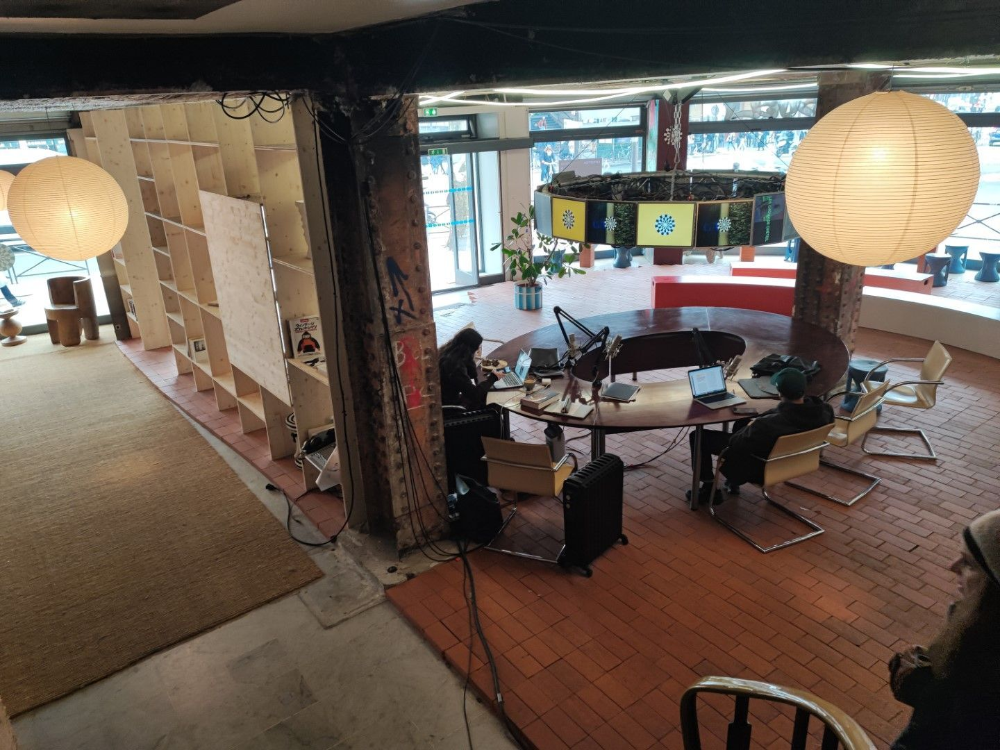

## Ordre du Jour

&gt;1. Se poser et se présenter

&gt;2. Actu de la communication ([www.commentwowmaintenant.com](http://www.commentwowmaintenant.com/))

- Nouveau site web [www.lesgrandsvoisins.com](http://www.lesgrandsvoisins.com/)
- Reconnaissance en tant que coopérative pour [www.lgv.coop](http://www.lgv.coop/)
- Utilisation de [agoodvillage.com](http://agoodvillage.com/) en anglais
- Utilisation de noms de domaine en terminaison .com (sauf [lgv.coop](http://lgv.coop/))

&gt;3. Actu sur les activités ([www.communititude.com](http://www.communititude.com/))

- Lancement des Popup Expos ([www.popup-expos.com](http://www.popup-expos.com/))
- Lancement de la salle de sociabilité numérique ([www.resdigita.com](http://www.resdigita.com/))
- Ateliers sur le numérique des Grands Voisins et ouverture de services ([www.resdigita.com](http://www.resdigita.com/))
- Orientation vers un observatoire ou un comité scientifique
- Lettre aux élues au sujet du tiers lieux Les Arches Citoyennes
- Les Grands Voisins en Turquie ?

&gt;6. Mots de la fin

### Items écartés

Les items suivants n'ont pas pu être traité pour manque de temps.

&gt;4. Actualités sur les Voisins ([www.quiquoietc.com](http://www.quiquoietc.com/))

- Un besoin de compétences en communication
- Un processus d’inscription

&gt;5. Actualités sur la vie de l’association coopérative ([www.lesgrandsvoisins.com](http://www.lesgrandsvoisins.com/))

- Régularisation d’inscription d’association loi 1901
- Budget et ouverture de compte en cours
- Candidature auprès de Plateau Urbain et recherche de locaux
- Agression verbale et menace d’un directeur d’Aurore

## Déroulement

### 1. Tour de table

Lors de la Tour de table se sont présentés en ordre Maël, Philippe Lemeur, Sviatlana, Chris, Bruno, Claudie, Philippe Lemeur, Foreman, Pourya.

Les associations suivantes ont été présentées: Second Souffle, Les Amis du 20e, et une autre. Nous sommes particulièrement reconnaissants à Union Jeuneuse Internationale et Les Oiseaux Migratoires pour leur accueil.

### 2. Communication

Présentation des nouveaux sites :

- lesgrandsvoisins.com / agoodvillage.com
- lgv.coop
- quiquoietc.com / whowhatetc.com
- village.tel (maintenant probablement resdigita.com)
- popupos.com

Information sur l'agrément identity.coop.

### 3. Activités

#### 3.1. Popupos

Nous avons présenté les Popup Expos (popupos.com) par [un document du Bureau du Createur](https://old.lesgrandsvoisins.com/documents/5/Pop_Up_Expos-Pr%C3%A9sentation_Le_Bureau_du_Cr%C3%A9ateur.pdf). Marine du Bureau du Créateur étant absente, Chris a fait la présentation. Maël co-anime les Popupos avec Marine et d'autres ont ajouté les observations suivantes.

- Apporter un cadre claire
- Aider l'artiste à vendre
- Lister des artistes
- Lister les oeuvres des artistes (titre, dimensions, photo, etc.)
- Faire des expos collectifs (il y a par exemple 17 oeuvres exposées au-dessus)
- Penser à faire la suite des Arts Voisins (Gallérie aux Grands Voisins dont Maël a été au coeur)
- Faire au nom des Grands Voisins .com
- Communiquer, Faire de la visibilité, Penser aux canaux de diffusion
- Permettre un pourcentage de vente au commerçant
- Apporter un visibilité
- A quelle échelle est-ce maintenant ? Dans un avenir proche ? Lointain ?
- Faire de la porte à porte avec un document
- Faire de la communication croiser, interpeller les gens / populations
- Contacter une ressourcerie dans le 18e
- Définir un périmètre et faire prendre la mayonnaise
- Travailler des différences, penser au broadcasts
- Faire des reportages sur les expos (1 par semaine?)

#### 3.2. Salle de sociabilité numérique

Le budget participatif de 25.000€ est obtenu pour un investissement matériel. Un travail démarre avec la maison des association du 14e en mars.

Prendre en compte les commentaires d'Audrey Azoulay de l'UNESCO sur la pédagogie et la jeunesse, les enfants et le fait d'éviter les insultes.

Promouvoir un lien intergénérationnel. Mener un réflexion sur ce travail. Chris et Tanagra mènent l'effort.

Penser aux bénévoles à recruter. Est-ce que la salle est mobile ?

Penser à finir des dispositifs pour qu'ils soient utilisables par les Grands Voisins. Quelles sont les bases d'utilisation et d'utilisateurs.

Sviatlana aidera Chris sur la mise en priorité des travaux. J'ai noté quelque chose sur la pensée.

Il a aussi été question du [nom attirant pour les activités numériques](https://www.digisemble.com/fr/) des Grands Voisins, un nom qui chapeautera aussi la Salle de sociabilisation numérique. Les deux propositions ont été mises à voix (votes pouvant être exprimés jusqu'à dimanche 26 février minuit):

1. ResDigita.com
2. Village.tel (ou telvillage.com ou villagetel.com pour éviter des confusions)

Collège A : Village.tel

Collège B : ResDigita.com (2 pour ResDigita, 1 pour Village.tel)

Collège C : ResDigita.com (4 pour ResDigita, 2 pour Village.tel, 2 absentions)

#### 3.3. Création d'observatoire ou comité scientifique

Le Conseil des Voisins accorde le principe et oriente un groupe pour réfléchir de Tanagra, Chris et Maël pour proposer des objectifs, un période et un périmètre pour le prochain Conseil des Voisins. Le travail de ce groupe sera également sur le forum.

C'est bien pour les GV et c'est bien pour la société civile.

#### 3.4. Les Grands Voisins avec d'autres pays (la Turquie, etc.)

Si d'autres pays veulent faire Grands Voisins, oui, mais nous n'allons pas les chercher.

On consolide d'abord le modèle en France.

Je ressens du potentiel. Je pense qu'il y a un besoin. J'aimerais voir connecter les gens et le besoin. Il convient d'orienter un travail dans ce sens.

La force et la faiblesse des Grands Voisins est que ça concerne tout le monde.

Quel délai ? Comment commencer à faire vivre ?

Les gens peuvent avoir du mal à se retrouver. Il faut un travail de communication. Envergure.

### 4. et 5. Ecartés

Les sujets 4 et 5 sont écartés pour ne pas prolonger la réunion. Tenons les réunions à 1h15 nous permettra d'en faire plus souvent.

### 6. Mots de la fin

Bien que les commentaires sont prises en compte, les mots de la fin ne font pas partie du CR, s'agissant de la nature et la liberté d'expression.

\[En voici un fichier [PDF A4](https://old.lesgrandsvoisins.com/documents/7/2023-03-25-conseil.pdf) et un fichier [PDF A4 Livret](https://old.lesgrandsvoisins.com/documents/8/2023-03-25-conseil-livret.pdf) de ce CR.]

## Invitation

Paris 18e, ancien magasin Tati Barbès, **samedi le 25 février de 16h à 17h15** se tient le **16e Conseil des Voisins** pour suivre et diriger notre association coopérative (voir [notre avancement dans l’ordre du jour](https://wiki.lgv.coop//fr/votes/conseils/16e-conseil-2023-02-25#ordre-du-jour) ci-dessous). [Le lieux est magnifique](https://wiki.lgv.coop//fr/votes/conseils/16e-conseil-2023-02-25#le-lieu) et éphémère, vers sa fin. Ce serait court, cordial, convivial, engagé et tolérant.

2 bd Marguerite de Rochechouart 75018 Paris. 16h à 17h15  
Ordre du jour

Nous essayons de tenir nos Conseils à 1h15 pour pouvoir encourager plus de Conseils des Voisins.

Les sujets à traiter sont :

1. Se poser et se présenter
2. Actu de la communication ([www.commentwowmaintenant.com](http://www.commentwowmaintenant.com/))

<!--THE END-->

- Nouveau site web [www.lesgrandsvoisins.com](http://www.lesgrandsvoisins.com/)
- Reconnaissance en tant que coopérative pour [www.lgv.coop](http://www.lgv.coop/)
- Utilisation de [agoodvillage.com](http://agoodvillage.com/) en anglais
- Utilisation de noms de domaine en terminaison .com (sauf [lgv.coop](http://lgv.coop/))

<!--THE END-->

1. Actu sur les activités ([www.communititude.com](http://www.communititude.com/))

<!--THE END-->

- Lancement des Popup Expos ([www.popup-expos.com](http://www.popup-expos.com/))
- Lancement de la salle de sociabilité numérique ([www.libregood.com](http://www.libregood.com/))
- Ateliers sur le numérique des Grands Voisins et ouverture de services ([www.libregood.com](http://www.libregood.com/))
- Orientation vers un observatoire ou un comité scientifique
- Lettre aux élues au sujet du tiers lieux Les Arches Citoyennes
- Les Grands Voisins en Turquie ?

<!--THE END-->

1. Actualités sur les Voisins ([www.quiquoietc.com](http://www.quiquoietc.com/))

<!--THE END-->

- Un besoin de compétences en communication
- Un processus d’inscription

<!--THE END-->

1. Actualités sur la vie de l’association coopérative ([www.lesgrandsvoisins.com](http://www.lesgrandsvoisins.com/))

<!--THE END-->

- Régularisation d’inscription d’association loi 1901
- Budget et ouverture de compte en cours
- Candidature auprès de Plateau Urbain et recherche de locaux
- Aggression verbale et menace d’un directeur d’Aurore

<!--THE END-->

1. Mots de la fin

Contacter Chris [chris@lesgrandsvoisins.com](mailto:chris@lesgrandsvoisins.com) +33781811811 pour toutes questions.

## Supports

Vérifiez la discussion pour [ce 16e Conseil des Voisins des Grands Voisins, l’association](https://forum.goodv.org/t/16e-conseil-des-voisins-samedi-le-25-fevrier-2023-a-16h00/478) pour les dernières nouvelles au sujet de notre 16e Conseil des Voisins.

Le [CR du 15e conseil des Voisins se trouve ici](https://forum.gdvoisins.com/t/conseil-des-voisins-du-15-decembre-2022-compte-rendu/472).

## Le Lieu

Ce sera au rez-de chaussée, soit dans la salle derrière la table ronde d’accueil, soit dans le hall d’entrée. Merci à l’association [Les Oiseaux Migratoires](https://www.lesoiseauxmigrateurs.com/).

© [L’Union de la Jeunesse Internationale](https://www.timeout.fr/paris/actualites/on-a-visite-le-centre-culturel-experimental-installe-dans-lancien-tati-de-barbes-092322) (**Ancien Magasin Tati Barbès**)

Voici où aura lieu le Conseil des Voisins

2 bd Marguerite de Rochechouart  
75018 Paris  
Ancien magasin « TATI »

## Participation en Visio

Trois mots clefs sont mâitres pour la participation en visio:

1. Accueil
2. Confort
3. Sécurité

Aucun enregistrement ni audio ni vidéo n’est permis, ni par nous, ni par vous.

Merci d’allumer vos micros et caméras car cela renforce le sentiment de sécurité de tout le monde.

Venez au à l’ancien magasin Tati Barbès réhabilité avant que ce lieu magnifique ne ferme ! Nous allons aussi tenir une réunion au moins audio sur et sur [meet.lgv.coop](https://meet.lgv.coop/).

## Invitation

Voici l’invitation telle qu’elle vient d’être envoyée

## 16e Conseil des Voisins sam. 25 fév. de 16h à 17h15 !

*Bonjour Les Grands Voisins !*

Venez nombreux au 16e Conseil des Voisins **samedi le 25 février de 16h à 17h15** et sur [meet.lesgrandsvoisins.com](https://meet.lesgrandsvoisins.com/) !

Vérifiez la discussion pour [ce 16e Conseil des Voisins des Grands Voisins, l’association](https://forum.goodv.org/t/16e-conseil-des-voisins-samedi-le-25-fevrier-2023-a-16h00/478) pour les dernières nouvelles au sujet de notre 16e Conseil des Voisins.

Le [CR du 15e conseil des Voisins se trouve ici](https://forum.gdvoisins.com/t/conseil-des-voisins-du-15-decembre-2022-compte-rendu/472).

## Ordre du jour

Nous essayons de tenir nos Conseils à 1h15 pour pouvoir encourager plus de Conseils des Voisins.

Les sujets à traiter sont :

1. Les Popup Expos
2. La Salle de sociabilité numérique du budget participatif Paris 14e
3. La Communication et une annonce nouvelle
4. Les Services digitaux offerts par l’association
5. Notre recherche de locaux, l’état administratif et la considération d’association coopérative
6. Une proposition de comité scientifique
7. Ce que vous voulez

Venez nombreux !

Contacter Chris [chris@lesgrandsvoisins.com](mailto:chris@lesgrandsvoisins.com) +33781811811 pour toutes questions.

## Organisation

Lors de ma préparation de ce Conseil, j’ai noté les idées suivantes.

## Comment ça marche ?

Si vous venez en personne physique, vous êtes membre votant de l’association par votre volonté de l’être et avez une voix dans votre collège.

Si vous venez en vocation pour une profession, pour une communauté, ou pour une personne morale, autant que vous pouvez contribuer aux GV dans cette capacité dans de multiples autres activités des GV.

## Pourquoi participer ?

A défaut d’une présentation commune arrêtée, pour moi, Chris, je pense que Les Grands Voisins proposent une fondation solide à partir d’un manifeste bien réfléchie (100 personnes sur 2 ateliers sur 1 mois). Ce manifeste passe bien un peu partout et confère à notre association une responsabilité importante pour permettre à un plus grand nombre de personnes, de communautés, et de personnes morales à s’en approprier comme si elles sont toutes voisines.

La force, pour moi toujours, est dans la variabilité d’engagement dans une structure stable. C’est comme dans la vie de tous les jours, en tant que voisine ou voisin, c’est vous qui décidez le dégré d’engagement et les partages communs que vous voulez avec vos voisins. Aux GV, c’est pareil: vous décidez. Etre avec vos voisins par choix change tout.

Nous nous inspirons d’un lieu, d’un contexte, et d’une date précis qui nous mènent à nous orienter envers:

1. les institutions de services sociaux y compris dans leurs interactions avec leurs bénéficiaires
2. les artistes, artesans, professionnels, associations et entreprises, y compris dans leurs interactions avec leurs prospects et clients
3. les lieux et les activités de rassemblement public tels que les cafés, restaurants, bars, théatres, etc. y compris avec leurs consommateurs et leurs spectateurs
4. les pouvoirs publics

Notre métier principal est l’écoute. Nous fournissons une structure dans laquelle plusieurs activités peuvent naître. Nous nous efforcons d’une posture à pouvoir toujours rendre des comptes systematiquement et efficacement sur toutes nos activités.

Je pense que notre manière de vouloir sincèrement être au service des utilisateurs à qui nous nous efforçons de rendre des comptes est particulièrement pratique pour le domaine digital. Quand vous utilisez Google ou Microsoft, ces sociétés ne vous rend pas des comptes. Pour moi, ça change quelque chose. De surcroit, nous utilisons comme guide non pas seulement la loi, mais aussi [le Contrat pour le web](https://www.contractfortheweb.org/fr).

Pour moi, une Grande Voisine ou un Grand Voisin, c’est l’être humain en vocation. Par exemple, une boulangérie est une voisine grâce à la présence de la personne morale et aussi la présence des êtres humains à l’intérieur (de tous les statuts). Par exemple, les personnes qui habitent à côté de moi on une vocation de propriétaire ou locataire. Les Voisins ne sont pas les personnes ni les rôles, mais les personnes dans des rôles. Les rôles peuvent aller de consommateur, à salarié, à bénévole, à mandataire sociale, à élu, à citoyen du monde, etc.

Une partie de la responsabilité des Grands Voisins est aussi d’entendre un large panel de définitions des Grands Voisins qui ne sont pas toutes compatibles mais toutes aussi valables. C’est une clef pour l’appropriation par un plus grand nombre, et pourquoi la marque Les Grands Voisins est mieux en marque ouverte. Soyez Grands Voisins.

Inversement, l’association Les Grands Voisins (.com) a besoin de l’engagement des vocations, des entreprises, des professionnels, des artistes, des artesans, des pouvoirs publics, des lieux et activités de cultivation publique, des donnateurs, etc. pour vivre. Les choses que nous partageons viennent et sont confiées pour ces acteurs. Bref: notre productivité sociale et économique correctement encadrées ont leurs places dans l’association.

Etre membre votant, c’est être une personne physique. Le même votant est notre unité de respect de base. Chaque membre votant peut s’identifier à des rôles différants, et peut participer aussi avec ces rôles. De même, les acteurs professionnels, commerciaux, culturels, artistiques, artisanaux peuvent distinctement s’identifier en tant que Grands Voisins dans notre association de par différantes activités. Notre association essaye d’être digne de tout cela.

Cela peut semble long, ce qui est écrit dessus. Cela peut même sembler être complexe. Pourtant, la proposition de base me semble être *compelling* et simple. Nous utilisons l’image d’un voisinage qui comporte des activités socio-économiques diverses pour mettre la priorité sur chaque être humain dans son rôle ou ses rôles multiples afin d’être et de mettre en commun de manière intentionnel et libre, le tout sur une fondation fiable, explicite et stable.

## Mise à jour du lieu

Attention ***changement de lieu***:

[L’Union de la Jeunesse Internationale](https://www.timeout.fr/paris/actualites/on-a-visite-le-centre-culturel-experimental-installe-dans-lancien-tati-de-barbes-092322) (**Ancien Magasin Tati Barbès**)

2 bd Marguerite de Rochechouart  
75018 Paris  
Ancien magasin « TATI »  
Metro Barbes, Lignes 2 et 4

Merci à l’association Les Oiseaux Migratoires.

Ce sera au rez-de chaussée, soit dans la salle derrière la table ronde d’accueil, soit dans le hall d’entrée.

## Invitation par SMS

Conseil des Grands Voisins Samedi le 25 fév. Paris 18e, 16h à 17h15, ancien magasin Tati Barbès, et à distance. Nous essayons d’avancer dans la diversité et dans la transparence. Inscription et liens vers infos ici: [https://www.lgv.coop/fr/coop/inscription](https://www.lgv.coop/fr/coop/inscription)

Les Grands Voisins Town Hall meeting Sat Feb 25 in Paris (18th) and distance from 4PM to 5:15 PM Paris time. Wonderful place. We strive for diversity and accountability. Signup and info here: [https://www.lgv.coop/fr/coop/inscription](https://www.lgv.coop/fr/coop/inscription)

## Logistique

Au plaisir de vous retrouver au Conseil à Paris 18e, ancien magasin Tati Barbès, **samedi le 25 février de 16h à 17h15** se tient le [**16e Conseil des Voisins**](https://wiki.lgv.coop/fr/votes/conseils/16e-conseil-2023-02-25) pour suivre et diriger notre association coopérative (voir [notre avancement dans l’ordre du jour](https://wiki.lgv.coop/fr/votes/conseils/16e-conseil-2023-02-25#ordre-du-jour) ci-dessous). [Le lieux est magnifique](https://wiki.lgv.coop/fr/votes/conseils/16e-conseil-2023-02-25#le-lieu) et éphémère, vers sa fin. Ce serait court, cordial, convivial, engagé et tolérant.  
[Cliquer ici pour avoir le programme complet.](https://wiki.lgv.coop/fr/votes/conseils/16e-conseil-2023-02-25)  
  
2 bd Marguerite de Rochechouart 75018 Paris 16h à 17h15 Si vous venez à distance, merci de consulter notre [note sur la participation visio](https://wiki.lgv.coop/fr/votes/conseils/16e-conseil-2023-02-25#participation-en-visio).Lien d’inscription :

## **Ordre du jour**Nous essayons de tenir nos Conseils à 1h15 pour pouvoir encourager plus de Conseils des Voisins.Les sujets à traiter sont :

1. Se poser et se présenter
2. Actu de la communication ([www.commentwowmaintenant.com](https://www.commentwowmaintenant.com/))

<!--THE END-->

- Nouveau site web [www.lesgrandsvoisins.com](https://www.lesgrandsvoisins.com/)
- Reconnaissance en tant que coopérative pour [www.lgv.coop](https://www.lgv.coop/)
- Utilisation de [agoodvillage.com](https://www.agoodvillage.com/en) en anglais
- Utilisation de noms de domaine en terminaison .com (sauf [lgv.coop](https://www.lgv.coop/fr))

<!--THE END-->

1. Actu sur les activités ([www.communititude.com](https://www.communititude.com/))

<!--THE END-->

- Lancement des Popup Expos ([www.popup-expos.com](https://www.popup-expos.com/fr))
- Lancement de la salle de sociabilité numérique ([www.libregood.com](https://www.libregood.com/fr))
- Ateliers sur le numérique des Grands Voisins et ouverture de services ([www.libregood.com](https://www.libregood.com/fr))
- Orientation vers un observatoire ou un comité scientifique ?
- Lettre aux élues au sujet du tiers lieux Les Arches Citoyennes
- Les Grands Voisins en Turquie ?

<!--THE END-->

1. Actualités sur les Voisins ([www.quiquoietc.com](https://www.quiquoietc.com/))

<!--THE END-->

- Un besoin de compétences en communication
- Un processus d’inscription

<!--THE END-->

1. Actualités sur la vie de l’association coopérative ([www.lesgrandsvoisins.com](https://www.lesgrandsvoisins.com/))

<!--THE END-->

- Régularisation d’inscription d’association loi 1901
- Budget et ouverture de compte en cours
- Candidature auprès de Plateau Urbain et recherche de locaux
- Aggression verbale et menace d’un directeur d’Aurore
- Demande d’agrément d’intérêt général

<!--THE END-->

1. Mots de la finContacter Chris chris@lesgrandsvoisins.com +33781811811 pour toutes questions.

## **Supports**Vérifiez la discussion pour [ce 16e Conseil des Voisins des Grands Voisins, l’association](https://forum.goodv.org/t/16e-conseil-des-voisins-samedi-le-25-fevrier-2023-a-16h00/478) pour les dernières nouvelles au sujet de notre 16e Conseil des Voisins.Le [CR du 15e conseil des Voisins se trouve ici](https://forum.gdvoisins.com/t/conseil-des-voisins-du-15-decembre-2022-compte-rendu/472).

## **Le Lieu**Ce sera au rez-de chaussée, soit dans la salle derrière la table ronde d’accueil, soit dans le hall d’entrée. Merci à l’association [Les Oiseaux Migratoires](https://www.lesoiseauxmigrateurs.com/).© [L’Union de la Jeunesse Internationale](https://www.timeout.fr/paris/actualites/on-a-visite-le-centre-culturel-experimental-installe-dans-lancien-tati-de-barbes-092322) (**Ancien Magasin Tati Barbès**)Voici où aura lieu le Conseil des Voisins2 bd Marguerite de Rochechouart 75018 Paris Ancien magasin “TATI”Venez au à l’ancien magasin Tati Barbès réhabilité avant que ce lieu magnifique ne ferme !

## **Participation en Visio**Trois mots clefs sont maîtres pour la participation en visio:

1. Accueil
2. Confort
3. SécuritéAucun enregistrement ni audio ni vidéo n’est permis, ni par nous, ni par vous.Merci d’allumer vos micros et caméras car cela renforce le sentiment de sécurité de tout le monde.Nous allons aussi tenir une réunion au moins audio sur et sur [meet.lgv.coop](https://meet.lgv.coop/).Chris Mann is inviting you to a meeting.Join the meeting: [https://8x8.vc/vpaas-magic-cookie-15b65cc344ea4050aa054030a02658aa/SampleAppMajorFootballsResearchWhere](https://8x8.vc/vpaas-magic-cookie-15b65cc344ea4050aa054030a02658aa/SampleAppMajorFootballsResearchWhere)To join by phone instead, tap this: +33 9 70 73 18 64,3144964135# +33 9 70 73 18 64,3144964135#Looking for a different dial-in number? See meeting dial-in numbers: [https://8x8.vc/vpaas-magic-cookie-15b65cc344ea4050aa054030a02658aa/static/dialInInfo.html?room=SampleAppMajorFootballsResearchWhere](https://8x8.vc/vpaas-magic-cookie-15b65cc344ea4050aa054030a02658aa/static/dialInInfo.html?room=SampleAppMajorFootballsResearchWhere)If also dialing-in through a room phone, join without connecting to audio: [https://8x8.vc/vpaas-magic-cookie-15b65cc344ea4050aa054030a02658aa/SampleAppMajorFootballsResearchWhere#config.startSilent=true](https://8x8.vc/vpaas-magic-cookie-15b65cc344ea4050aa054030a02658aa/SampleAppMajorFootballsResearchWhere#config.startSilent=true)