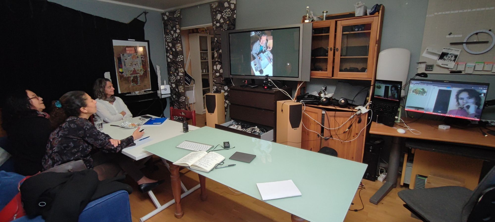

## Votes (en cours)

### Vote 1 : Autorisation d'ouverture des comptes en banque

Il est autorisé d'ouvrir un compte en banque à Sogexia et un compte en banque à SumUp.

Collège A : 1/1  
Collège B: 2/2  
Collège C: 3/3

### Vote 2 : Epouser les trois principes d'intrêt général

Nous ne contournons aucunement et épousons avant toute autre chose à part le manifeste des Grands Voisins les trois principes d'intérêt général pour leurs définitions propres et notre compréhension que ceci:

1. Altruisme complet: nos implications dans les Grands Voisins ne nous apporte aucun avantage matériel, même indirect.
2. Gouvernance autonome: nos intérêts dans notre gouvernance ne prend en considération que l'intérêt des Grands Voisins et non pas des intérêts ailleurs que nous pourrions avoir ; et la gouvernance des Grands Voisins est uniquement par nous-mêmes.
3. Externalités: nous ne pouvons pas prédire par avance les beneficiaries de nos actions prinicpales car celles-ci sont pour un bénéfice large et motivées pour l'amélioration générale au lieu de l'amélioration spécifique.

Collège A : 1/1  
Collège B: 2/2  
Collège C: 3/3

## Information

### Langement d'un appel à dons (structure)

Il a été décidé de lancer un appel à dons sur la base du manifeste et des projets en gestation et sur l'engagement de neutralité, et sur la notion de portail. Notre offre n'est pas exactement au point encore en tant qu'association recevant les dons et nous pouvons améliorer notre visibilité de notre métier et ambitions.

### Présentation prochaine du projet d'Observatoire des Grands Voisins

Nous avons privilégié le terme "observatoire" pour les deux termes proposés au 16e Conseil des Voisins. Il y a d'ailleurs un Observatoire de la Démocratie Locale du 14e auquel nous nous intéressons.

### Possible rapproche contre le Conseil de Paris au sujet du Budget participatif de Paris 2022

Le conseil de Paris a redirigé 25.000 euros vers un projet d'agrandissement de l'atleier de la Ressourcerie créative au lieu du Numérique créatif des Grands Voisins. Dans les débats au Conseil de Paris, notre association et Chris Mann ont été écartés, alors les moteurs du lauréat. Un avocat, Maître LEROY, pourra proposer à Chris MANN une requête en annulation de la délibération du Conseil de Paris du 17 mars 2023 rapporté par M. Florentin LETISSIER. Les personnes présentes sont (un peu trop) enthousiastes.

## Discussion

### Engager des Voisins

### Impact de la déclaration générale

### Notion de responsable des actions: Les Grands Voisins ou les Grands Voisins

### Binôme Chris et Maël arrêté (impact activité artistique)

### ResDigita

### Vision

## Lettre éditoriale de rappel

Bonjour,

Le 18e Conseil des voisins aura lieu ce soir de **20h à 21h15** à [meet.lgv.coop](https://meet.lgv.coop), et chez moi à Fontenay-aux-Roses. L'accueil, la sécurité et le confort de cette réunion dépend de moi et de vous: il n'y a pas d'enregistrement de l'audio ni du vidéo, mais du chat. Le fait de vous nommer, puis d'activer vos caméras et micros augmentent la notion de sécurité pour les autres. Tout devrait être décrit sur [meet.lgv.coop](https://meet.lgv.coop).

Lors de cette préparation pour le 18e conseil, il y a effectivement des nouvelles. Le plus important est la parole de Mme. la Maire du 14e arrondissement, Carine PETIT, qui me suggère de laisser tomber la notion de responsabilité de la marque Les Grands Voisins. Dans ce sens que nous ne pouvons pas prendre responsabilité pour les autres, cela a du sens. Je comprends qu'il convient de se concentrer sur le présent et l'avenir.

Les contraintes d'organisme d'intérêt général sont:

1. Aucun avantage matériel pour les individus ou organisations, même indirect, du fait de notre participation
2. Aucune influence externe dans notre gouvernance
3. Bénéfices uniquement par externalités pour donc des populations non-pas délimitées par avance

Ces contraintes ne sont pas neutres. Elles sont essentielles à la légitimité des Grands Voisins. Je pense qu'elles sont nécessaires et peut-être suffisantes pour notre fonctionnement. Elles mettent en question un de nos engagements en tant que coopératif: l'engagement économique des coopérants. Je présenterai pourquoi ma pensée préliminaire sur la compatibilité de ces deux engagements.

Le budget participatif **Le numérique créatif des Grands Voisins** (25.000 euros) aurait été attribué en grande partie à un autre budget de 55.000 euros avec un autre objectif: remplacer l'atelier de la Ressourcerie Créative de 70m² par un atelier de 110 m2. De surcroît, il parait que les débats au Conseil de Paris aurait fait abstraction de notre association et de la vision du numérique créatif des Grands Voisins depuis 2016. Il y a une suggestion de considérer un recours en annulation de délibération du Conseil de Paris à considérer. La cible est la rentrée (mais l'infrastructure réseau pourrait y être insuffisant finalement).

La compétence principale pour faire marcher le numérique créatif est la mienne, et c'est une compétence que je peux utiliser pour gagner ma vie: l'informatique. Je pense qu'il convient peut-être de revoir une décision du 16e Conseil des voisins d'utiliser le terme resdigita.com pour nos activités numériques. L'idée est de centrer Les Grands Voisins, association d'intérêt générale coopérative. Pour ma vie professionnelle, je dois personnellement m'assurer d'une séparation nette des activités.

Maël est actuellement dans une place personnelle qui m'empêche personnellement de m'investir à son côté. Si cela change, ce serait avec plaisir de reprendre le binôme d'avant. Cela ne regarde que moi personnellement et non pas l'association. Maël s'est entretenu brièvement avec la Ministre déléguée aux personnes en situation de handicap, expose actuellement à Africa Week à l'UNESCO, a fait un don de « La Reine » à l'UNESCO et entretien un rapport pluriannel avec la Directrice de l'UNESCO.

La Mairie du 14e développe un observatoire de la démocratie locale. J'en ferai un article de blog prochainement. J'y vois la fibre qui a donné lieu au site Saint Vincent de Paul !

Nous avons participé au salon Inclusiv'Day où plusieurs autres acteurs ont choisi de vouloir être dans notre annuaire. C'est un honneur.

A 20h pour certaines et certains d'entre vous sur [meet.lgv.coop](https://meet.lgv.coop).

Chris MANN  
[chris@lesgrandsvoisins.com]()  
07 81 811 811

## Invitation

Notre [18e Conseil des voisins](https://blog.lesgrandsvoisins.com/18e-conseil/) aura donc lieu [mardi le 6 juin de 20h à 20h15](https://www.lesgrandsvoisins.com/event/18e-conseil-des-voisins-33/register). Ce conseil suit le même cadre des autres conseils: comfort, accueil, sécurité. Nous avons ouvert notre compte en banque et il convient de commencer à concrétiser ce que nous voulons dire par nos engagements en tant qu'association de loi 1901 d'intérêt général coopérative multisectorielle (temps de mettre en pratique). Nous aurions aussi été peut-être snobés au Conseil de Paris. Il semble y avoir une mouvance générale pour la privatisation de l'ESS. Nous aimerions profiter d'un local. Nous pourrions concrétiser notre modèle et lancer une idée d'université populaire des Grands Voisins.

Le CR du 17e Conseil des Voisins est ici:

[17e Conseil des Voisins - 2 mai 2023 - CR
\
Nous avions eu le 17e Conseil des Voisins le 2 mai 2023. Nous avons acté : 1. Notre statut de coopératif et ses engagements2. Notre statut d’intérêt général et ses engagements3. Des questions administratives Compte-rendu version 2023-05-04-01
\
Les Grands VoisinsChris Mann
\
](https://blog.lesgrandsvoisins.com/17e-conseil/)

Les autres conseils des voisins sont ici:

[Coopérations
\
Chacun peut autant contribuer de son identité à ses différentes communautés, autant que chacun puisse en enrichir son identité.
\
Les Grands VoisinsChris Mann
\
](https://blog.lesgrandsvoisins.com/cooperations/)

De tête, je pense que nous allons traiter au moins les sujets suivants:

Coopérations

- Nouveau compte en banque et administratif et financier (nouveau compte en banque)
- Communication (Nouvelles)
- Appel à donations
- Positionnement (Comité scientifique peut-être, intérêt général et association coopérative)
- Local
- Les besoins et les apports dans un cadre transparent

Digital

- Budget participatif de Paris
- Conseil digital
- Projets digitaux (remplacer Google par exemple, lgvmail.com peut-être, web fait main fait maison)

Arts

- Galerie
- Popup Expos

Participation en Visio sur [meet.lgv.coop](https://meet.lgv.coop/).

Trois mots clefs sont maîtres pour la participation en visio:

1. Accueil
2. Confort
3. Sécurité

Aucun enregistrement ni audio ni vidéo n’est permis, ni par nous, ni par vous.

Merci d’allumer vos micros et caméras car cela renforce le sentiment de sécurité de tout le monde.

Nous allons aussi tenir une réunion au moins audio sur et sur [meet.lgv.coop](https://meet.lgv.coop/).

Pour celles et ceux qui souhaitent, nous nous retrouvons aussi chez moi, Chris, à Fontenay-aux-Roses.