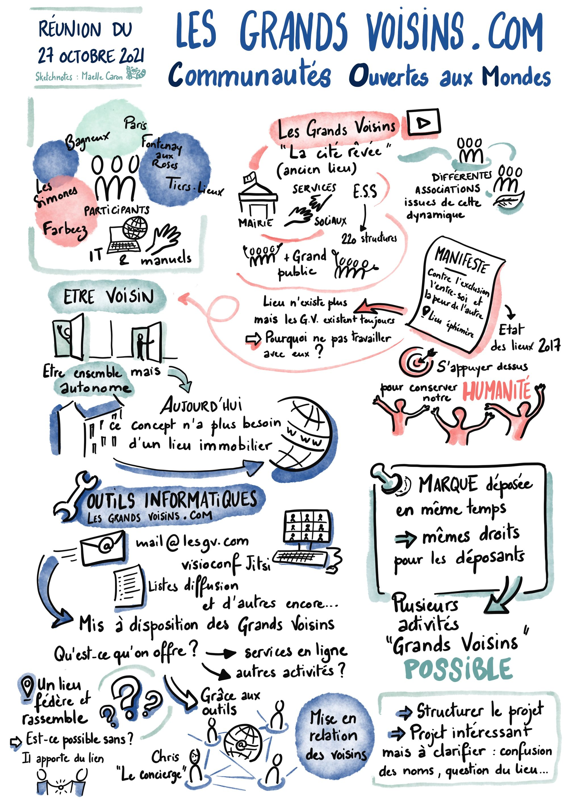

Merc. 27 oct. '21 19h30 Farbeez &amp; 20h15 Les Grands Voisins Bagneux et en viséo

[Les Grands Voisins COM reunion du 27 10 2021
\
Les\_Grands\_Voisins\_COM\_-\_reunion\_du\_27-10-2021.pdf
\
1 MB
\
download-circle](./files/2023/04/Les_Grands_Voisins_COM_-_reunion_du_27-10-2021.pdf "Download")

## Invitation

Bonsoir,

J'ai le grand plaisir de vous inviter à  
la réunion [Farbeez](https://www.farbeez.com) &amp; [Les Grands Voisins](https://www.lesgrandsvoisins.com)  
**ce mercredi** 27 octobre 2021  
de **19h30 à 21h** (Farbeez avant et Les Grands Voisins après 20h15)  
en ligne à  
[https://jitsi.lesgrandsvoisins.com/farbeez](https://jitsi.lesgrandsvoisins.com/farbeez)  
(merci de tester votre équipement dès maintenant si vous pouvez)  
et aux Simones  
17 bis rue Blanchard 92220 BAGNEUX  
avec une technologie qui amène les personnes à distance dans la salle, et les gens dans la salle à distance.

Cette réunion bénéficiera de la facilitation graphique de [Maelle Caron](https://view.genial.ly/605f14756bd9330d1ecc3d4d/personal-branding-maelle-caron-portfolio) comme vous pouvez voir de son travail fugueur pour notre courte réunion de planification de la réunion ci-dessous:

Nous nous sommes rencontrés le 27 octobre 2021 pour affiner le concept des Grands Voisins.

## Présentation du concept

Nous avions au départ la présentation des quatre populations citées:

1. les pouvoirs publics locaux
2. les institutions des services sociaux
3. l’économie sociale et solidaire dont

<!--THE END-->

- les artistes
- les artisans
- les associations
- les entreprises

<!--THE END-->

1. les acteurs du grand public et le grand public

Nous avons visionné [la bande d’annonce des Grands Voisins 1](https://youtu.be/budyDXkH3r4) : Le Cité Rêvé. Il est observé que [lesgrandsvoisins.org](http://lesgrandsvoisins.org/) existe toujours même si le lieu à Saint Vincent de Paul n’existe plus.

## Manifeste des Grands Voisins

J’ai lu un [Manifeste des Grands Voisins (2017)](https://mailing.lesgrandsvoisins.com/t/declaration-dinterdependance/11). Nous avons vu son contexte en 2017 et son contexte ce jour. Cela nous a touché.

Etre voisin implique l’existence de murs et portes. Cela donne un certain sécurité. L’autonomie de chanque Voisine et Voisin donne une fondation plus solide à l’ensemble.

Comment peut ce concept de murs dépasser les murs ?

## La marque

La marque est déposé le 19 février 2021, soit [le même jour qu’un autre déposant](https://mailing.lesgrandsvoisins.com/t/hasard-de-marque/32). Aujourd’hui les exploitants de [lesgrandsvoisins.com](http://lesgrandsvoisins.com/) (.com comme communautés ouvertes aux mondes) et [lesgrandsvoisins.org](http://lesgrandsvoisins.org/) avons les même protections de l’INPI.

## En ligne

Pour amorcer la pompe, j’ai pu avancer le [Numérique autonome et interdépendante](https://mailing.lesgrandsvoisins.com/t/numerique-autonome-et-interdependante/41) à la base du [Contrat pour le web](https://www.contractfortheweb.org/fr/) avec des services en ligne suivants:

- intermédiaire public de courrier électronique (iredmail,com avec Postfix)
- comptes de courriers électroniques @lesgv.com (Dovecot pour IMAP et POP3)
- accès web SoGo pour Webmail, Calendrier et Contacts
- un serveur de listes de diffusion List Monk
- serveur public de vidéoconférence (Jitsi)
- un système de gestion de contenu (ApostropheCMS)
- et d’autres encore

## En personne

Les Grands Voisins avons une permanance le samedi après-midi aux Simones (ancien synagogue, Bagneux) et une présence le mardi après-midi à Linklusion (Tour Montparnasse, Paris 14e). Les lieux physiques permettent de rassembler. Il s’agit du liant et du lien. Il peut s’agir de la mise en relation.

## Ensemble

Je m’offre depuis quelques mois en tant que « concièrge » des Grands Voisins. Les prohcaines étapes comprennent des intérêts de structuration, de clarification, et de spécifiaction des lieux.

## Facilitation graphique

Nous avions le bénéfice d’une facilitatation graphique dont voici le compte-rendu [en PDF ici 3](https://www.asuswebstorage.com/navigate/a/#/s/B36736DE0E6B484995B8CEAF9214AC1CW) et en image ci-dessous.

* * *