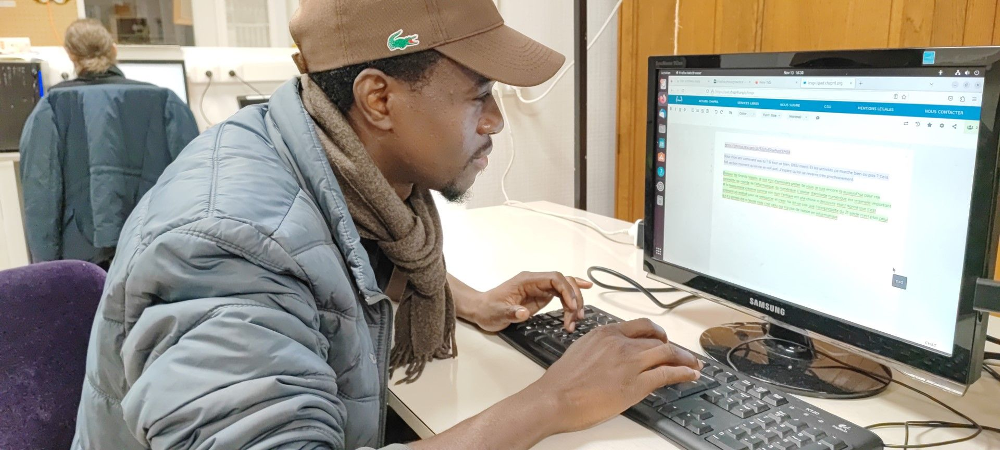

Voici les premiers mots de Thimoté sur un ordinateur

> Salut mon ami comment vas-tu ? Si tout va bien, DIEU merci. Et les activités ça marche bien ou pas ? Cela  fait un bon moment qu’on ne se voit pas. J’espère qu’on se reverra très prochainement.

Et Timothée revient deux semaines plus tard pour ajouter à l'article.

> Bonjour les Grands Voisins,

> Je suis ravi d’entendre parler de vous. je suis encore là aujourd’hui pour me connecter au monde de l’informatique, du numérique. L’atelier d’entraide numérique est vraiment important et la ressourcerie créative comme son nom l’indique est une chose a découvrir étant donné que c’est vraiment un endroit pour se ressourcer et créer.

> Ne dit-on pas que l’analphabète du 21 siècle n’est plus celui qui n’a jamais été a l’école mais c’est celui qui n’a pas de notion en informatique.

Timothée revient et tappe tout seul