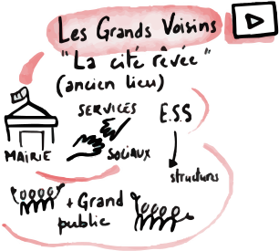
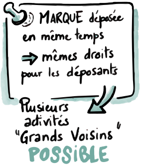

J'ai été attaqué pour plusieurs raisons. Souvent, on m'accuse d'instiguer les agresseuses et les agresseurs. « Pour qui me prendrai-je ? » l'un peu penser. J'ai passé un bon moment à réfléchir à cette proposition sous formes différentes.

Au contraire des étiquettes récurrentes que je reçois, peut-être même de manière coordonnée, augmentée et accentuée, je pense que mes actions personnelles sont mieux guidées en me considérant comme « n'importe qui ». Par hasard, je me retrouve personnellement avec la responsabilité de la Marque Les Grands Voisins en même temps qu'un dépôt collectif de trois organisations puissantes que je nommerai ci-après « le Consortium ».  Ce court article permettrait de poser rapidement des observations partiales face à des accusations très moches et destructrices contre moi.

## Je suis Grand Voisin

N'importe qui peut être Grand Voisin. Je suis n'importe qui. Donc, je peux être Grand Voisin. C'est une propriété transitive. De même, si vous pouvez admettre aussi vôtre côté « n'importe qui », en plus de tout d'être particulier et unique, vous aussi, vous pouvez être Grand Voisin.

Il se trouve que j'ai édité une version d'un document « Manifeste » des Grands Voisins : un document avec des contributions de plus de cent personnes sur deux grands ateliers sur un mois en 2017. Tout de suite à cette élaboration du Manifeste, et dans un contexte de mutation de culture de management du lieu Saint-Vincent-de-Paul, j'ai monté et ai annoncé sur les voies de communication internes un wiki en français, en arabe et en anglais de débat sur le site web du nom de domaine de mon dépôt wiki.lesgrandsvoisins.com.  Sous trois mois, le wiki a été cyber-attaqué.

Les Grands Voisins "La cité rêvée" (ancien lieu) : Mairie, Services sociaux, E.S.S. : structures + Grand public

Plus d'une année passe. Le 19 février 2019, je me reveille avec une impulsion de déposer la marque « Les Grands Voisins ». Il n'il y a avait jamais eu de discussion avec qui que ce soit sur le sujet de la marque Les Grands Voisins. Je n'y ai pas pensé la veille, de même le jour après avoir déposé la marque. Trois mois plus tard, je reçois la confirmation de l'INPI et je vérifie si une autre personne ne l'aurait pas déposée entretemps. Il se trouve que le Consortium a déposé effectivement la même marque (sauf avec un logo) en collectif le même jour que moi. Un employé de l'INPI me déclare que dans ces 42 ans à l'INPI, il n'a jamais vu ce cas. Nous avons tous les deux – le Consortium et moi-même – les mêmes droits dans un régime de simultanéité de la marque (régime jusqu'à une réforme de décembre 2019). Moi et le Consortium sont voisins.

Marque déposée en même temps : mêmes droits pour les déposants. Plusieurs activités "Grands Voisins" POSSIBLE

C'est une bonne chose que nous soyons deux à détenir la Marque Les Grands Voisins. D'une part, cela rend la marque potentiellement une propriété ouverte car si un tiers veut s'en servrir, effectivement moi et le Consortium devons effectivement tous deux nous y opposer. C'est parfaitement à l'image des Grands Vosins. D'autre part, pour moi personnellement, je suis amateur de théologie (par exemple, j'ai célébré un mariage religieux sur le site Saint-Vincent-de-Paul). L'histoire de ma journée du 19 février 2019 est romantique et divine. Cette histoire, pour tout étudiant de théologie, est une histoire belle à cultiver.

La Marque est si forte. Notre héritage commun est si important. Le monde est meilleur avec Les Grands Voisins. Nous essayons de voir en quelle capacité cette marque peut être appliqué au-délà du lieu contraint qui était Saint-Vincent-de-Paul. Les autres ne veulent pas utiliser la marque, mais la Marque a sa place de par sa proposition intrinsèque.

Il y a une belle juxtaposition d'idées dans la Marque. Tout d'abord, lorsque l'on utilise « les », l'on fait référence à une déMarquation. On parle des étranger, des autres, des américaines, ..., les Autres. Puis, on dit que les Autres sont « Grands ». C'est déjà une force. Enfin, on parle des autres, car on parle des « Voisins », c'est à dire ceux qui sont en dehors de chez soi. La Marque est ingénie. Son manifeste est bien à son image.

Pour ma part, je suis légitime uniquement par ma qualité de n'importe qui. Je suis légitime car je ne suis pas illégitime.

Aujourd'hui ce concept n'a plus besoin d'un lieu immobilier

L'idée de l'association coopérative Les Grands Voisins est d'appliquer le concept sans la contrainte des murs.

## Le Civisme serait contagieux

Je suis attaqué. Les attaques ont mené des tiers, au moins trois, mais probablement plus. J'ai eu gain de cause dans un procès civil en 2021, puis certaines actions sont allés loin. Cela fait toujours mal. Ce sera pour une prochaine fois.