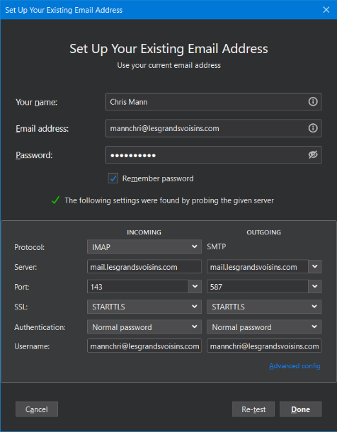

Nous utilisons notre propre serveur public d’envoi de courriels. Cela nous permet de ne pas faire transiter nos messages par des intermediaries tels que gmail, mailchimp, mailjet, hotmail, yahoo ou bien d’autres.

Si vous utiliser un tiers tel que gmail, hotmail, etc…, nous livrons le message directement à votre gestionnaire de courriel. De notre côté, nous en sommes autonomes.

Cela nous a pris de l’effort pour être connu par l’internet entier comme une poste électronique responsable. Il y avait des configurations à faire et des enregistrements à effectuer. En principe, nous devrions aussi surveiller notre statut comme emaileur responsable dans le temps. C’est pour cela que nos mels ne tombent pas dans votre SPAM (et merci de nous signaler tout courriel inapproprié au lieu de le tagger SPAM svp).

Pour les geeks, il s’agit donc d’un serveur MTA (Mail Transport Agent) sur SMTP (le protocole d’envoi de courriels). Les enregistrements SPF, DKIM et DMARC identifient électroniquement notre certificat de chiffrement, notre nom de domaine validé et notre politique anti-spam respectivement. Nous opérons aussi les courriels [abuse@lesgrandsvoisins.com](mailto:abuse@lesgrandsvoisins.com) et d’autres relatifs à la gestion de la poste électronique des Grands Voisins. Nous utilisons les serveurs Dovecot et Postfix pour ce faire avec un certificat LetsEncrypt.

Les emails de [mailing.lesgrandsvoisins.com](http://mailing.lesgrandsvoisins.com/) et [list.lesgrandsvoisins.com](http://list.lesgrandsvoisins.com/) sont maintenant correctement envoyés part notre serveur en autonomie sans intérimaire correctement et ne tombent plus dans le SPAM comme était le cas la semaine dernière pour cause d’utilisation du mauvais serveur de courriels.  
\[quote="mannchri, post:3, topic:107"]

# Message de bienvenue pour son nouvel compte de courriel

Salut,

Il y a une nouvelle poste électronique des Grands Voisins (.com)

[https://mail.lesgv.com/SOGo/index/](https://mail.lesgv.com/SOGo/index/)

Ton login est ton @ courielle complète et ton mot de passe initial est ci-dessous.

[ppppffff@lesgrandsvoisins.com]()

MOTDEPASSE

Pense à changer ton mot de passe pour un autre qui soit propre à toi. Vous pouvez le faire sur l’interface SOGo ici.

[https://mail.lesgv.com/SOGo/index/](https://mail.lesgv.com/SOGo/index/)

L’interface web fait bien l’affaire, mais pour configurer d’autres choses (Android), voici les indications rapides ci-dessous en anglais.

Pour configurer le courriel:

- Le nom d’utilisateur des services SMTP/POP3/IMAP doit être l’adresse électronique complète.\`
- Service POP3 : port 110 sur STARTTLS (recommandé), ou port 995 avec SSL.
- Service IMAP : port 143 sur STARTTLS (recommandé), ou port 993 avec SSL.
- Service SMTP : port 587 sur STARTTLS. Si vous devez prendre en charge d’anciens clients de messagerie avec SMTP sur SSL (port 465), veuillez consulter notre tutoriel : Activer le service SMTPS (SMTP sur SSL, port 465).
- Adresses des serveurs CalDAV et CardDAV : [SOGo](https://mail.lesgrandsvoisins.com/SOGo/dav/)&lt;adresse email complète&gt;

\[quote="mannchri, post:3, topic:107"]

# Message de bienvenue pour son nouvel compte de courriel

Salut,

Il y a une nouvelle poste électronique des Grands Voisins (.com)

[https://mail.lesgv.com/SOGo/index/](https://mail.lesgv.com/SOGo/index/)

Ton login est ton @ courielle complète et ton mot de passe initial est ci-dessous.

[ppppffff@lesgrandsvoisins.com]()

MOTDEPASSE

Pense à changer ton mot de passe pour un autre qui soit propre à toi. Vous pouvez le faire sur l’interface SOGo ici.

[https://mail.lesgv.com/SOGo/index/](https://mail.lesgv.com/SOGo/index/)

L’interface web fait bien l’affaire, mais pour configurer d’autres choses (Android), voici les indications rapides ci-dessous en anglais.

Pour configurer le courriel:

- Le nom d’utilisateur des services SMTP/POP3/IMAP doit être l’adresse électronique complète.\`
- Service POP3 : port 110 sur STARTTLS (recommandé), ou port 995 avec SSL.
- Service IMAP : port 143 sur STARTTLS (recommandé), ou port 993 avec SSL.
- Service SMTP : port 587 sur STARTTLS. Si vous devez prendre en charge d’anciens clients de messagerie avec SMTP sur SSL (port 465), veuillez consulter notre tutoriel : Activer le service SMTPS (SMTP sur SSL, port 465).
- Adresses des serveurs CalDAV et CardDAV : [SOGo](https://mail.lesgrandsvoisins.com/SOGo/dav/)&lt;adresse email complète&gt;

Pour des détails sur les contacts, les calendriers et d’autres clients (je pense) en anglais:

- [Exchange ActiveSync: Setup Android devices](https://docs.iredmail.org/activesync.android.html)
- [Exchange ActiveSync: Setup BlackBerry 10 devices](https://docs.iredmail.org/activesync.bb10.html)
- [Exchange ActiveSync: Setup iOS devices](https://docs.iredmail.org/activesync.ios.html)
- [Exchange ActiveSync: Setup Outlook 2013 for Windows](https://docs.iredmail.org/activesync.outlook.html)
- [Setup Thunderbird: POP3/IMAP, SMTP and global ldap address book](https://docs.iredmail.org/configure.thunderbird.html)
- [Setup Thunderbird: SOGo Address Book and Calendar synchronization with CardDAV and CalDAV](https://docs.iredmail.org/thunderbird.sogo.html)
- [Mac OS X: Add contact service (CardDAV) in Contacts.app](https://docs.iredmail.org/sogo.macosx.contacts.html)
- [Mac OS X: Add calendar (CalDAV) and task (Reminders) service in iCalendar.app](https://docs.iredmail.org/sogo.macosx.icalendar.html)

N’hésite pas à me contacter en cas de question(s).

–  
Chris Mann [mannchri@lesgrandsvoisins.com]()  
+33768403838 [www.lesgrandsvoisins.com](http://www.lesgrandsvoisins.com) Pensez à vous inscrire à notre liste de diffusion.

Pour des détails sur les contacts, les calendriers et d’autres clients (je pense) en anglais:

- [Exchange ActiveSync: Setup Android devices](https://docs.iredmail.org/activesync.android.html)
- [Exchange ActiveSync: Setup BlackBerry 10 devices](https://docs.iredmail.org/activesync.bb10.html)
- [Exchange ActiveSync: Setup iOS devices](https://docs.iredmail.org/activesync.ios.html)
- [Exchange ActiveSync: Setup Outlook 2013 for Windows](https://docs.iredmail.org/activesync.outlook.html)
- [Setup Thunderbird: POP3/IMAP, SMTP and global ldap address book](https://docs.iredmail.org/configure.thunderbird.html)
- [Setup Thunderbird: SOGo Address Book and Calendar synchronization with CardDAV and CalDAV](https://docs.iredmail.org/thunderbird.sogo.html)
- [Mac OS X: Add contact service (CardDAV) in Contacts.app](https://docs.iredmail.org/sogo.macosx.contacts.html)
- [Mac OS X: Add calendar (CalDAV) and task (Reminders) service in iCalendar.app](https://docs.iredmail.org/sogo.macosx.icalendar.html)

N’hésite pas à me contacter en cas de question(s).

–  
Chris Mann [mannchri@lesgrandsvoisins.com]()  
+33768403838 [www.lesgrandsvoisins.com](http://www.lesgrandsvoisins.com) Pensez à vous inscrire à notre liste de diffusion.

Bonne nouvelle, le courriel a un résultat 10/10 en termes de déliverabilité !

[https://www.mail-tester.com/test-x85yjefac](https://www.mail-tester.com/test-x85yjefac)

