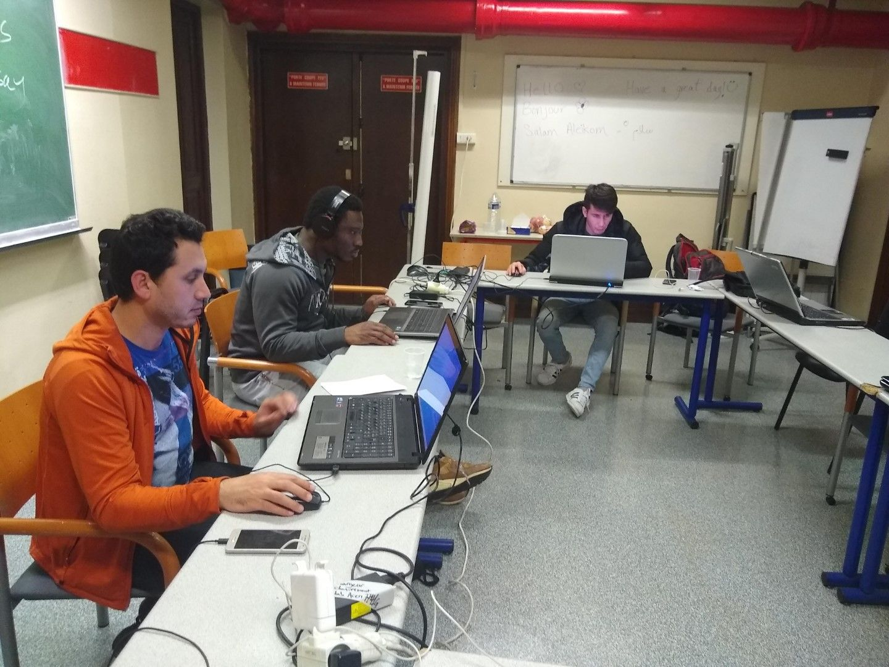
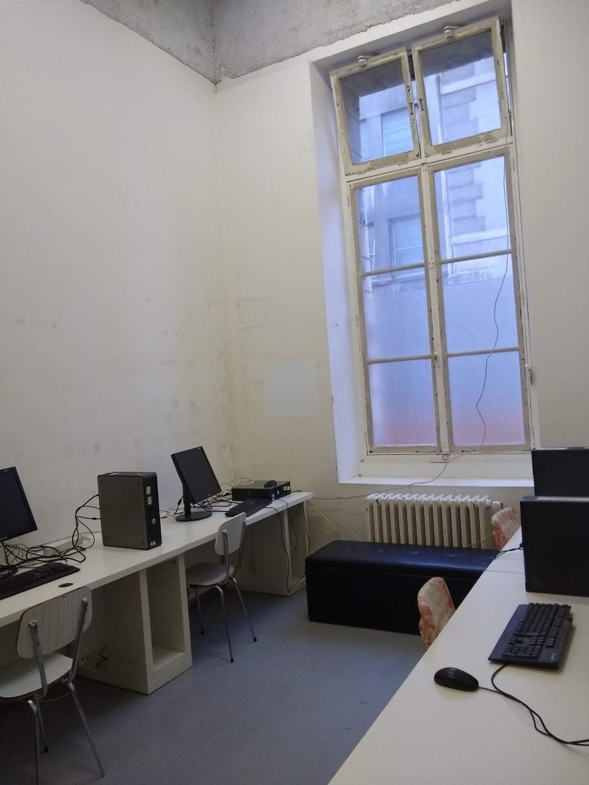
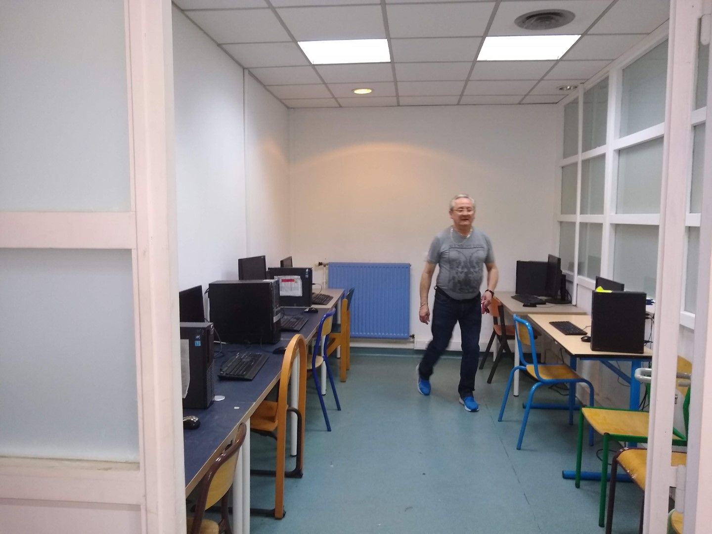
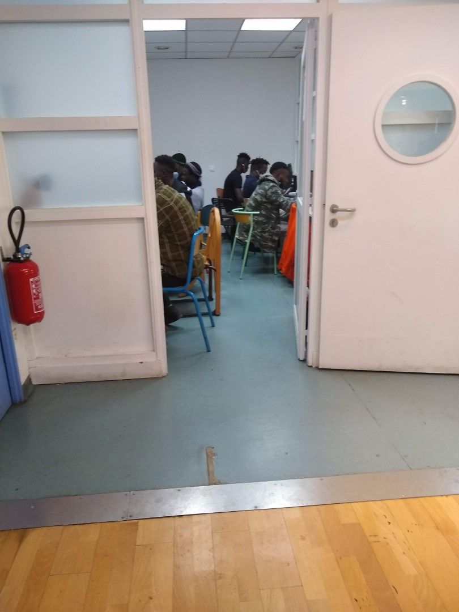
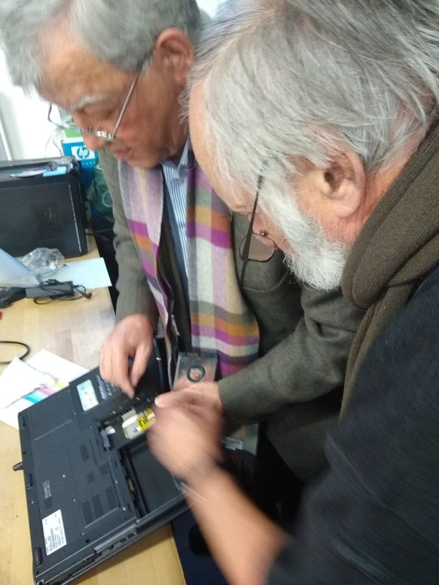
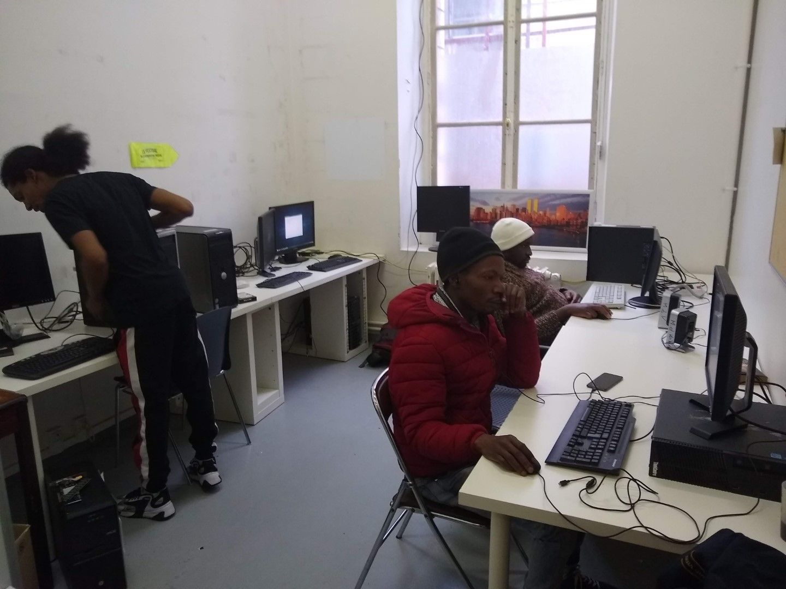
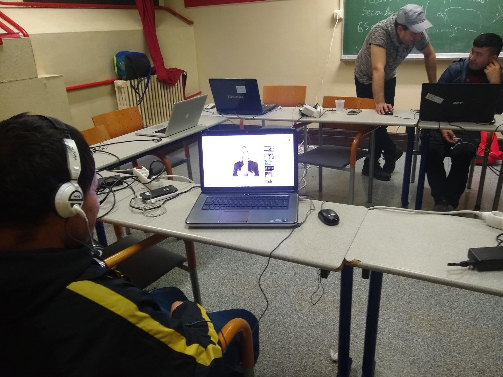
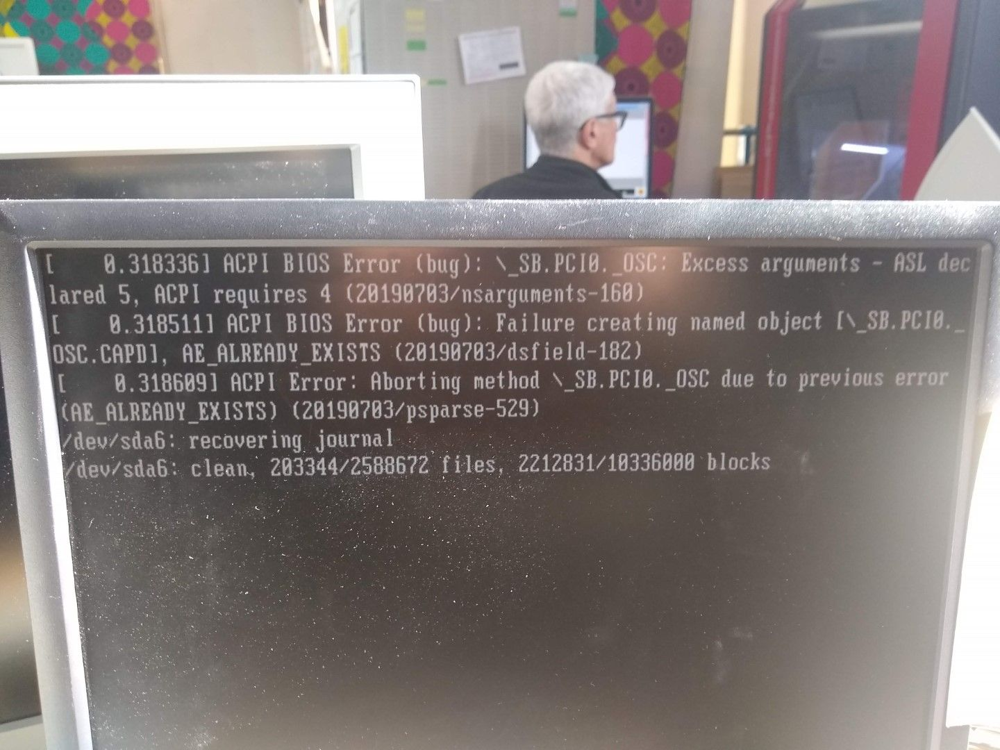
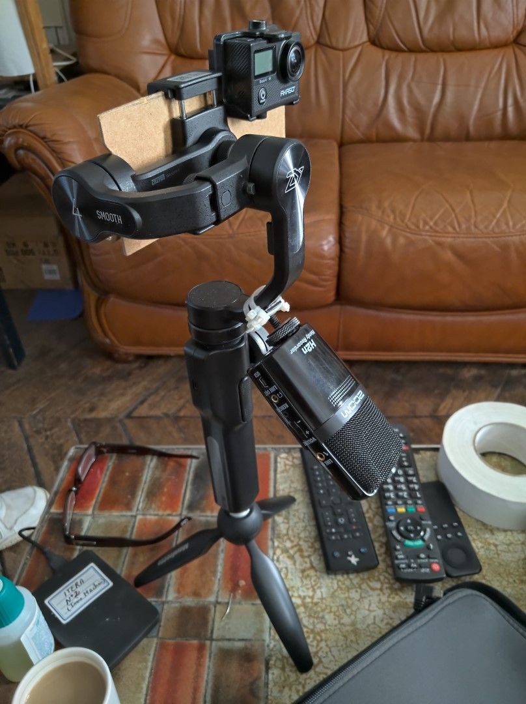

Hôtel de ville de Paris, le 18 octobre 2022, les propositions gagnantes pour les budgets participatifs de Paris sont annoncés dont la ligne « Du matos pour les assoc » dont fait partie « [le Numérique créatif des Grands voisins 2](https://www.lesgrandsvoisins.com/fr/activites-des-grands-voisins/budget-participatif-de-paris/) » pour une salle de sociabilité numérique.

Le projet est monté par la Maison des associations et de la vie associative de la Mairie du 14e arrondissement, ce qui convient particulièrement pour Les Grands Voisins (.com), car notre héritage vient justement d’un lieu du 14e arrondissement. Cet effort est un exemple de ce que peut faire Les Grands Voisins, Communautés ouvertes aux mondes avec la collaboration de la Ressourcerie créative et de Chris Mann.

Des milliers d’habitants du 14e arrondissement ont participé au scrutin. Notre lot a été un total de 950.000 euros dont 25.000 euros pour notre salle de sociabilité numérique. Seulement trois ou quatre projets ont été retenus parmi une douzaine de projets proposés.

Aux habitants du 14e, merci, et nous espérons vous montrer un dispositif digne de votre confiance!

Voici la page sur notre site internet :

[Budget Participatif avec la Mairie du 14e et la Ressourcerie créative
\
Budget Participatif Paris Les Grands Voisins de par La Ressourcerie Créative et Chris Mann proposent un Budget Participatif à la Ville de Paris pour votes à partir de septembre 2022.
\
Les Grands VoisinsChris Mann
\
](https://blog.lesgrandsvoisins.com/budget-participatif-avec-la-mairie-du-14e-et-la-ressourcerie-creative/)

Photos en lien avec la salle de sociabilité numérique

Voici la page sur le site web du budget participatif de Paris:

[budgetparticipatif.paris.fr](https://budgetparticipatif.paris.fr/bp/jsp/site/Portal.jsp)

### [Budget Participatif - Paris](https://budgetparticipatif.paris.fr/bp/jsp/site/Portal.jsp)

Site du Budget Participatif de la Mairie de Paris