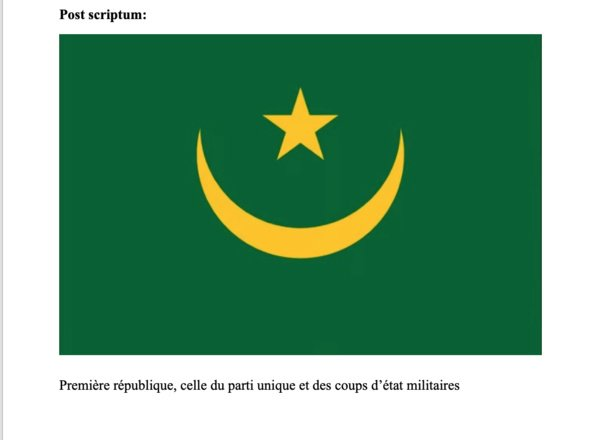
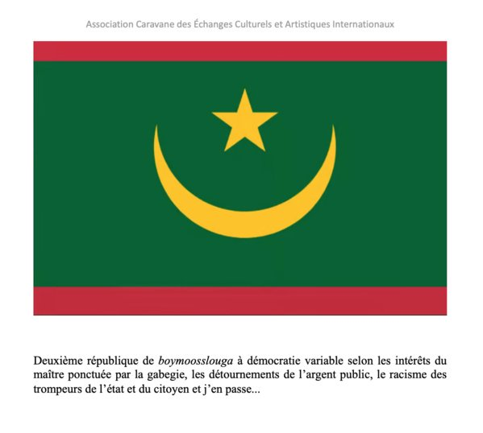
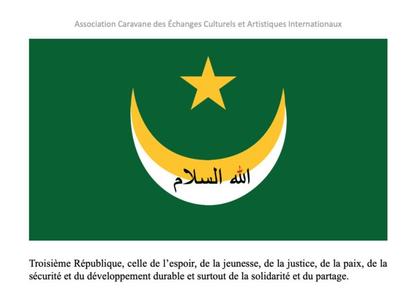

Excellence, cher frère et parent…

Je tiens, dans mon for intérieur, à vous féliciter pour votre brillante et paisible élection pour un deuxième mandat. Celui de l’espoir, de l’émergence, de la paix sociale, de la sécurité et de la promotion de l’action de l’énergie de notre jeunesse consciente et laborieuse pour le développement de notre cher pays. Jeunesse à qui vous avez dédié votre auguste campagne pour les élections présidentielles de 2024.La perfection n'appartient qu'à Allah, cependant bien que le jeu démocratique est en évolution dans le bon sens de notre pays nous avons assistés à de petits couacs de mauvais perdants de l’élection présidentielle menaçant même la quiétude sociale.

J'ai écris « frère et parent » sans être personnellement adepte du tribalisme pour vous rappeler nos liens de parentés séculaire et fraternels des deux ensembles Smalils et Ideyboussatt dont je suis fier.

Excellence, avec sérénité, calme et sagesse, lors de votre première déclaration juste après votre brillante victoire, vous avez affirmé que vous agiriez comme Président de tous les citoyens mauritaniens et que vous allez tendre la main à toutes et tous. Je vous prends au mots affirmés, tendez-moi la main afin de pouvoir créer le projet du Centre Culturel Mauritanien à Paris. Car tous les anciens présidents à qui j’en ai parlé l’on malheureusement occulté. Je vous prie d’être le président loyal et patriote qui va soutenir cet ambitieux projet culturel et artistique, bel outil pour l’image extérieure de notre pays que je porte depuis trois décennies.

Cela ne sera que justice à mon humble et patriote égard que de me nommer chargé de mission pour la création du Centre Culturel Mauritanien. Malheureusement ni l’ambassade à Paris, ni la délégation permanente à l’UNESCO n’ont un poste de conseiller culturel et artistique, ni aucunes compétences dans ce sens hélas !

L’ambassadeur de Mauritanie à Paris, mon frère et ami, le chevronné diplomate de notre pays son excellence DAHA TEYSS m’a affirmé que les textes diplomatiques stipulent que tout pays ayant une bonne relation avec la France peuvent aussi demander l’obtention d’un local pour créer un centre culturel et artistique et même son financement. Il me semble qu'il suffit juste d’une lettre de notre président au président français E. Macron, cette dernière transitera par l’ambassadeur de Mauritanie à Paris, et le tour est joué !

Ce futur centre culturel tel que je l’imagine aura une vitrine sur la rue, une gallérie d’exposition, un desk pour la promotion du tourisme et de l’artisanat, une librairie spécialisée sur la Mauritanie, un bureau collégial, un petit espace pour la prière et qui servira d’école coranique pour les enfants de la diaspora mauritanienne à Paris. Ainsi qu'une salle de conférences et de spectacle, et enfin un petit espace de restauration pour faire déguster à nos futurs visiteurs étrangers tous les produits de notre terroir.

En termes d’animation et de communication nous créerons des liens solidaires avec les potentiels investisseurs et avec la société civile française (associations et fondations). Voilà le tableau espéré tout en ayant concrètement les compétences requises pour cet important challenge. Nous envisageons de prendre en stage, pour l’animation et la gestion du lieu, un collège de jeunes garçons et filles de la diaspora Mauritanienne avec au minimum une licence ou un master. Un collège composé d’un ou d’une Wolof, Soninké, Pheul, Haratine ou Beydhane inchallah !

Excellence, je saute du coq au chameau pour vous faire part d’une importante idée, à mon sens, qui d'ailleurs pourrait être une grande innovation démocratique que nous enviera le monde et qui fera renaître une vraie et concrète unité nationale sur le terrain de la réalité sociale de notre pays. Notre saint Coran nous apprend la fraternité, la solidarité, la collégialité du pouvoir et des décisions politiques, économiques et sociales :

En sortant de la mosquée après la prière du vendredi dernier, une idée m’est venue spirituellement, une sorte « d’ilham rabbani » qui me dicte vigoureusement de vous en faire part..  
  
Puisque vous avez orienté votre campagne en ode à la jeunesse, pourquoi ne pas opter pour un pouvoir collégial en commençant par la présidence de la République. Et donc en nommant auprès de vous cinq vice-présidents de moins de 40 ans, ayant au minimum un doctorat d’état, issus de nos communautés, femmes ou hommes jeunes. Wolof, Soninké, Pheul, Haratine ou Beydhane en adaptant la constitution révisée et les textes législatifs idoines pour soutenir cette option.

Après la fin de votre deuxième mandat, par besoin de campagne présidentielle, seulement un vote à huis clos avec la voix prépondérante de président sortant qui désignera le président parmi les cinq vice-présidents pour un mandat de deux ans. Quand tous les vice-présidents seront élus de cette façon endogène, et quand vous serez revenu au pouvoir pour deux ans, vous pourriez lancer une campagne pour un candidat et ses cinq vice-présidents. Idem pour les ministres, pas besoin de faire un remaniement ministériel. Nommer auprès d’eux cinq vice-ministres pour deux ans chacun, le faire aussi pour les secrétaires généraux des  différents ministères, ainsi que pour tous les directeurs dans les ministères et dans toutes les directions des grandes entreprises d’état. Vous constaterez à court terme, avec ce sang neuf, que notre pays émergera rapidement dans un développement durable. A la condition de restructurer la justice, la détribaliser, la professionnaliser ainsi que d'avoir un œil structurant sur le monde des avocats et d'éloigner tous les trompeurs de l’état et des citoyens qui sont connus de tous avec une loi à établir et une justice ainsi révisée.

Je ne saurais terminer, mon président et cher frère, sans vouloir vous suggérer de remanier la scène politique par la force de la loi appuyée. Cependant notre pays n’a besoin que de trois partis politiques : un bon parti d’opposition collégial, un parti du centre collégial et un parti populaire qui soutient l’action gouvernementale où le gouvernement et ses fonctionnaires, ainsi que l’armée et les forces de sécurité n’y adhèrent pas. Également tous les petits partis cartables et autres pourraient ainsi s’intégrer à l’un des trois partis reconnus désormais par l’état. C’est une importante innovation démocratique qui inspira le dialogue politique national, l’enrichira, mettra la solidarité et l’entente politique et sociale  en marche pour le bien-être et le bonheur du peuple mauritanien. Mais surtout de renforcer, former et surveiller le monde associatif afin qu’il puisse assumer son rôle. Et enfin proclamer une loi pour ester en justice tous citoyens qui fait publiquement l'apologie de la violence, de la division, de la haine, du racisme ou qui inciterait à la guerre civile.

J’ai bien d’autres idées encore, j'ai une vision politique pour notre pays, sans être politicien mais artiste visionnaire, et je connais bien mon pays malgré mon exil en France provoqué par le système de *Boymoosslooga* alors par une injustice à l'encontre mon humble personne. Mais je m’arrête là pour ne pas vous ennuyer bien que l’ennui est un manque de Dieu et de foi en lui.

*Mes salutations respectueuses, merci infiniment, cordialement et fraternellement, patriotiquement vôtre.*

*Maël Mohamed Aïnine Néma Chérif Sidi ETHMANE*

Excellence,  
        Je vous prie de faire un referendum pour le drapeau de la 3e République et demande à tous ceux qui liront cette lettre ouverte et qui se retrouvent dans l’esthétique divine de ce nouveau drapeau de bien vouloir me faire un retour. Ce drapeau représente un croissant blanc tel un linceul en hommage à tous nos mort fussent-ils martyrs ou résistants entre autres. Et Salam le 6e nom d’Allah avec son accent rouge qui symbolise cette goutte de sang si métissé qui coule dans nos veines ainsi renforçant notre fraternité, notre solidarité et notre parenté.  

Première république de la Mauretanie

Deuxième république de la Mauretanie

Troisième république de la Mauretanie

Mise à jour en novembre 2024:

[https://youtu.be/k0U2AMVERtc](https://youtu.be/k0U2AMVERtc)