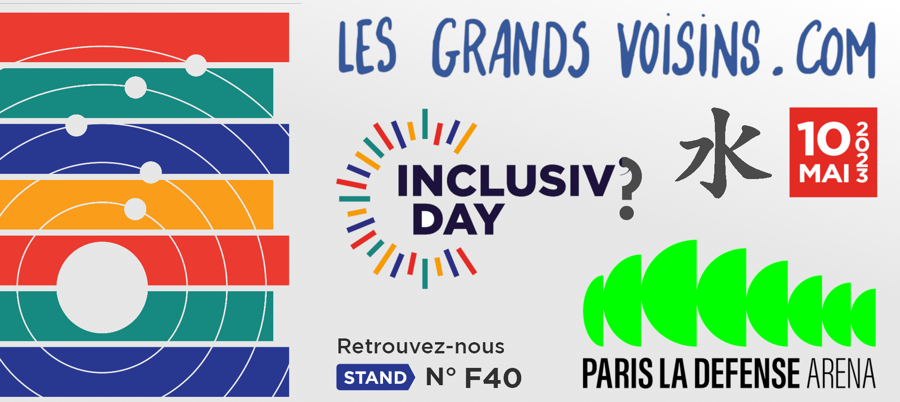

Le 10 mai 2023 à Paris La Défense Arena, venez nous rendre visite ainsi que d'autres acteurs autour du handicap et de la réalisation. Sur notre stand, nous aurions de l'art, le livre de Caroline et des démonstrations de nos axes digital et artistiques. L'organisateur parle d’un riche programme éditorial (management &amp; stratégie RSE, emploi inclusif, achats responsables, innovations sociales, accessibilité numérique, actualités handicap, ateliers de sensibilisation) des conférences thématiques, des ateliers de formation, des séances de networking et des animations immersives.

Inscription ici pour Les Grands Voisins et sur le site de l'organisateur respectivement:

[Inclusiv’Day 2023
\
Inscrivez-vous et participez à Inclusiv’Day le 10 mai 2023 à Paris La Défense Arena.
\
Inclusiv'Day 2023
\
](https://event.inclusivday.com/registration/inscription?iw_exhibitorid=c88bcbb6-f6dd-ed11-8e89-000d3a4a8203)

[Inclusiv’Day au CNIT 10 mai
\
Le 10 mai 2023 à Paris La Défense Arena, venez nous rendre visite ainsi que d’autres acteurs autour du handicap et de la réalisation. Sur notre stand, nous aurions de l’art, le livre de Caroline et des démonstrations de nos axes digital et artistiques. L’organisateur parle d’un riche programme
\
Les Grands VoisinsChris Mann
\
](https://blog.lesgrandsvoisins.com/nous-a-inclusivday-cnit-10-mai-2023/)

0 € de notre objectif de 650 € pour le financement de notre participation Inclusiv'Day, merci de penser à acheter nos services ou [effectuer un don](https://www.lesgrandsvoisins.com/dons) s'il vous plaît.

DATE ET HEURE

mercredi mai 10, 202308:30  19:00 (Europe/Paris) [Ajouter au calendrier](https://www.lesgrandsvoisins.com/event/inclusiv-day-au-cnit-defense-paris-25/register)

LIEU

CNIT la Défense2, parvis de La Défense  
92800 Puteaux