**lauréat du Budget Participatif de Paris 14e 2022**

Vous pouvez, par votre mécénat individuel ou collective, contribuer à rendre l’avancement informatique plus confortable, sécure et accueillante pour tout.e participant.e de tout âge et de tout niveau aux ateliers d’entraide du Numérique Créatif des Grands Voisins. Ce mécénat peut prendre plusieurs formes

**Animer des moments de socialisation** le lundi de 16h à 19h  
Une fois que vous avez appris l’approche, vous pouvez le reproduire ailleurs. Nous avons aussi, depuis cette année, aussi du matériel en serveurs et en prises et productions audio-visuels.

**Préparer et à améliorer le dispositif** par le choix et la préparation de matériaux à acquérir et à avoir un recul sur le déroulement du dispositif. Coordonnez l’intérêt pour des populations différentes (professeurs des écoles, professeurs, travailleurs sociaux, animateurs, etc) et pour des interventions ponctuelles pour des questions spécifiques (systèmes, réseaux, sécurité, etc.).

**Contribuer de l’informatique et/ou de l’argent** de toutes natures, soit pour nos usages à l’atelier, soit pour l’usage de personnes en précarité numérique. Vous pouvez effectuer des dons sur www.lesgrandsvoisins.com ou sur www.laressourceriecreative.com en précisant que votre don est destiné pour le numérique créatif des Grands Voisins.

**Prenez contact** avec Chris Mann par courriel au [chris@lesgrandsvoisins.com](mailto:chris@lesgrandsvoisins.com) ou par téléphone au 07 81 811 811

[Digital - Les Grands Voisins
\
Dans ce monde où les grands nous proposent des services de mailing lists, d’email et encore, nous pensons qu’il y a une place pour nous qui sommes structurellement redevable et allons à la rencontre à nos usagers. Nous nous basons aussi sur le contrat pour le web.
\
Les Grands Voisins
\
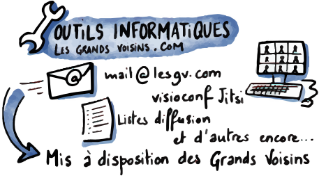](https://blog.lesgrandsvoisins.com/tag/resdigita/)

[Lancement du budget participatif
\
Je me permets de citer Pauline du Service Démocratie Locale de la Mairie du 14e qi a très bien résumé notre réunion comme suite: Nous avons pu échanger sur les 3 aspects de votre projet : * Du matériel informatique pour proposer des ateliers d’accessibilité numérique, qui soit pliable comme l’esp…
\
Les Grands VoisinsChris Mann
\
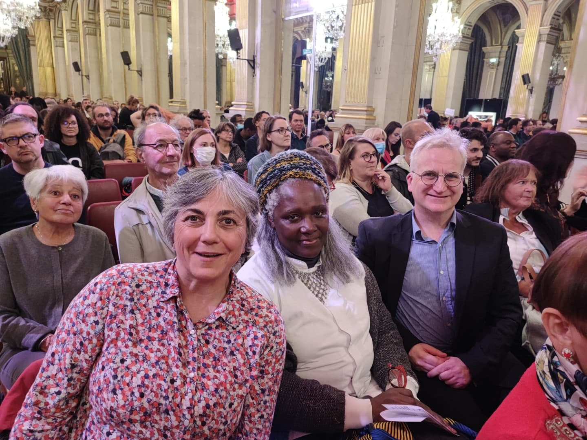](https://blog.lesgrandsvoisins.com/lancement-du-budget-participatif/)

[Lauréat au Budget participatif avec la Mairie du 14e
\
Très bonne nouvelle, nous avons remporté le budget participatif pour « le numérique créatif des Grands Voisins », soit une salle de sociabilité numérique.
\
Les Grands VoisinsChris Mann
\
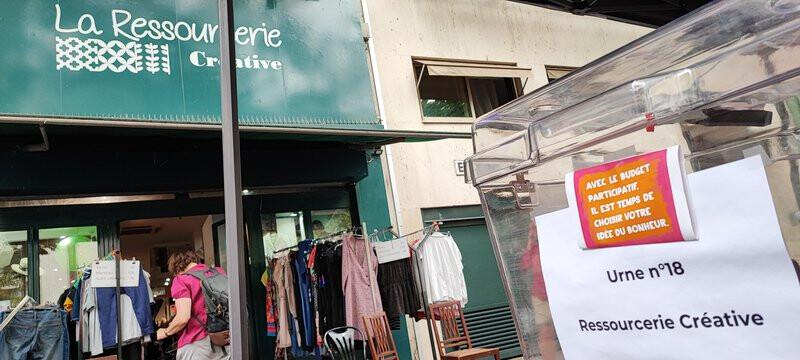](https://blog.lesgrandsvoisins.com/lauriat-budget-participatif-2022/)

[Budget Participatif avec la Mairie du 14e et la Ressourcerie créative
\
Budget Participatif Paris Les Grands Voisins de par La Ressourcerie Créative et Chris Mann proposent un Budget Participatif à la Ville de Paris pour votes à partir de septembre 2022.
\
Les Grands VoisinsChris Mann
\
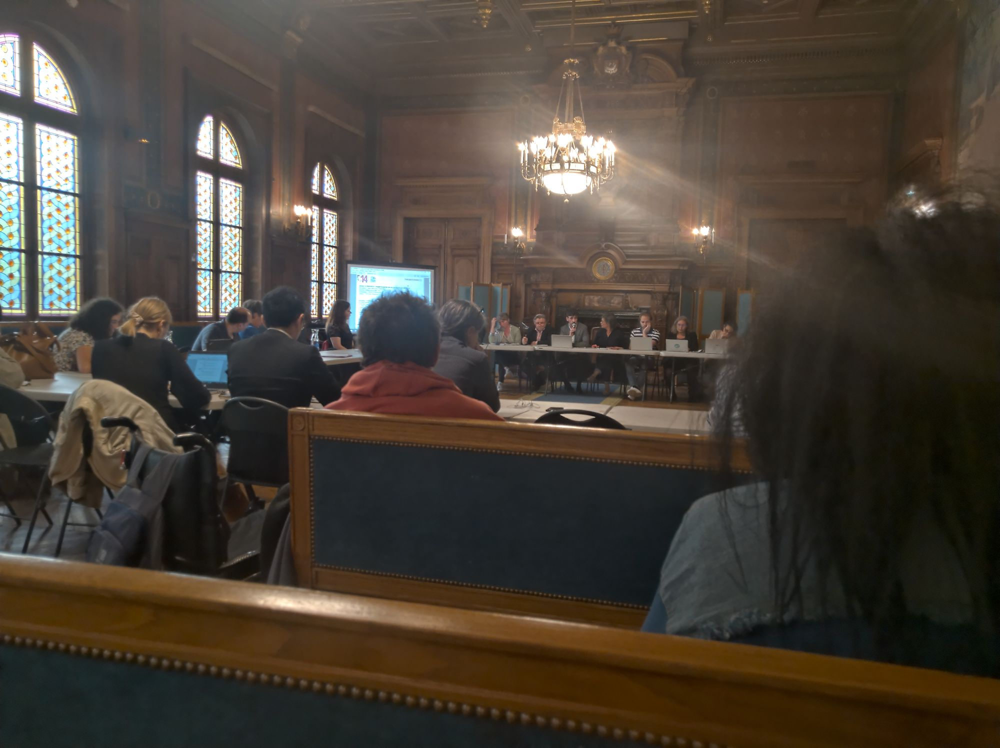](https://blog.lesgrandsvoisins.com/budget-participatif-avec-la-mairie-du-14e-et-la-ressourcerie-creative/)

[Salle de sociabilité numérique
\
Le Numérique Créatif des Grands Voisins est lauréat du Budget Participatif de Paris 14e 2022. Participez à ces ateliers conviviaux d’entraide numérique pour vous-même ou pour votre organisation. Vous pouvez y avancer vos projets et vos savoir-faire aussi en aidant d’autres avec les leurs. Tous ni…
\
Les Grands VoisinsChris Mann
\
](https://blog.lesgrandsvoisins.com/salle-de-sociabilite-numerique/)

[Appels à Mécénat
\
pour le Numérique Créatif des Grands Voisins, lauréat du Budget Participatif de Paris 14e 2022 Vous pouvez, par votre mécénat individuel ou collective, contribuer à rendre l’avancement informatique plus confortable, sécure et accueillante pour tout.e participant.e de tout âge et de tout niveau aux…
\
Les Grands VoisinsChris Mann
\
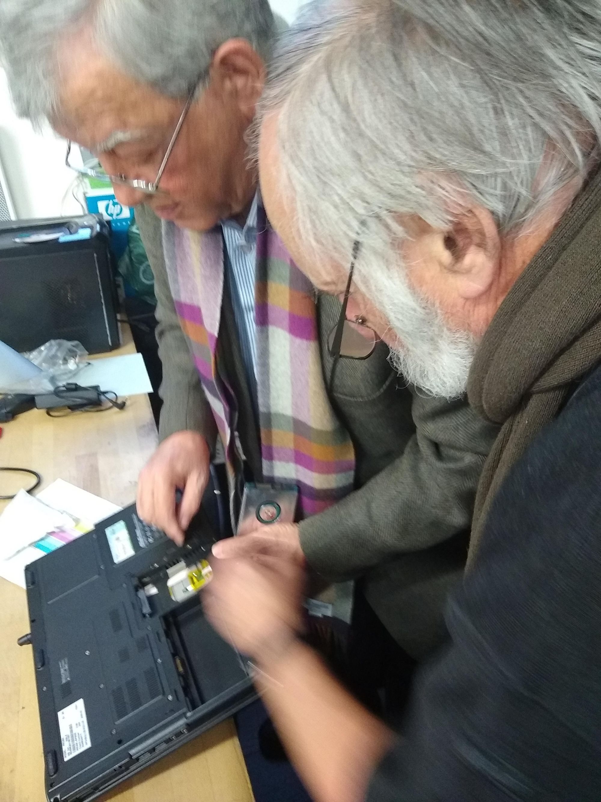](https://blog.lesgrandsvoisins.com/numerique-creatif-des-grands-voisins/)

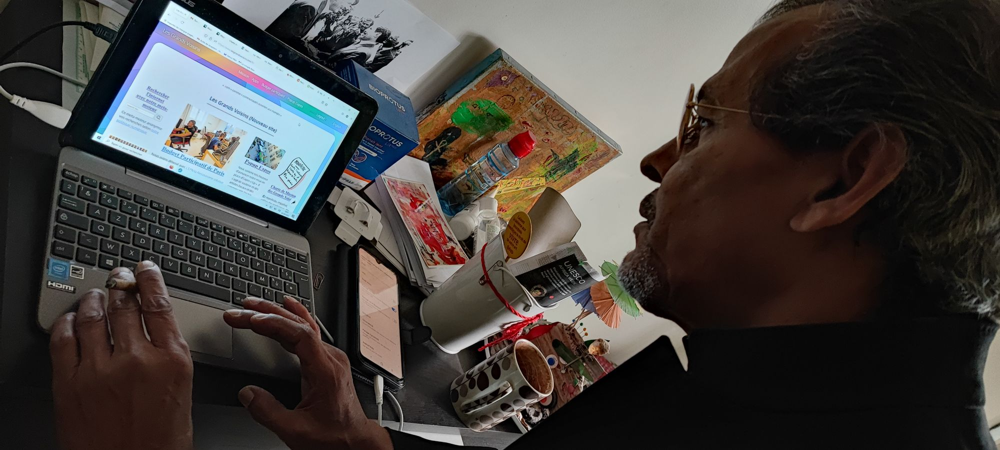

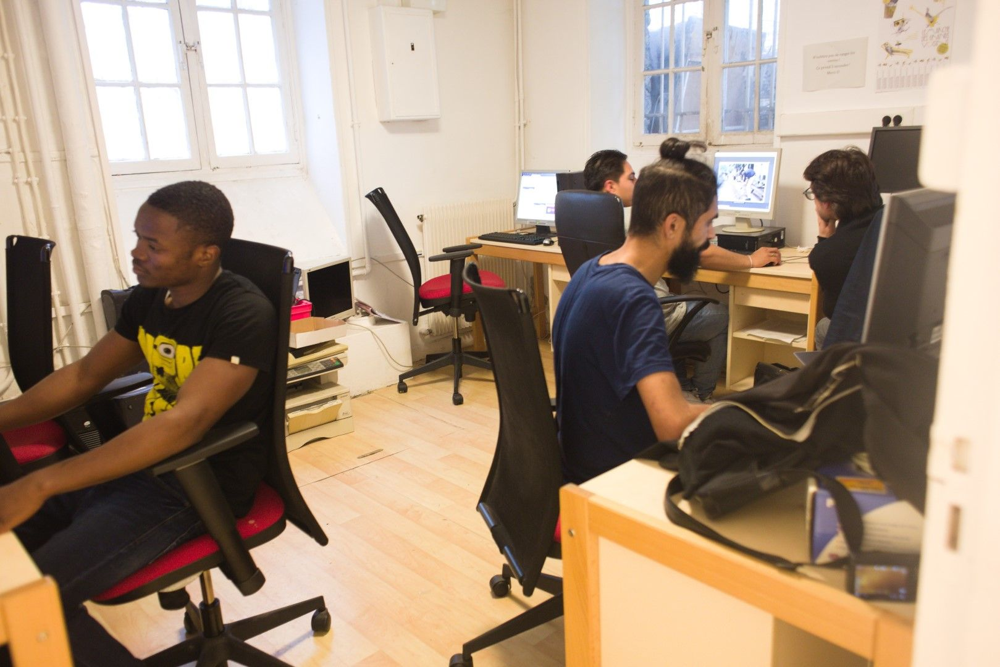

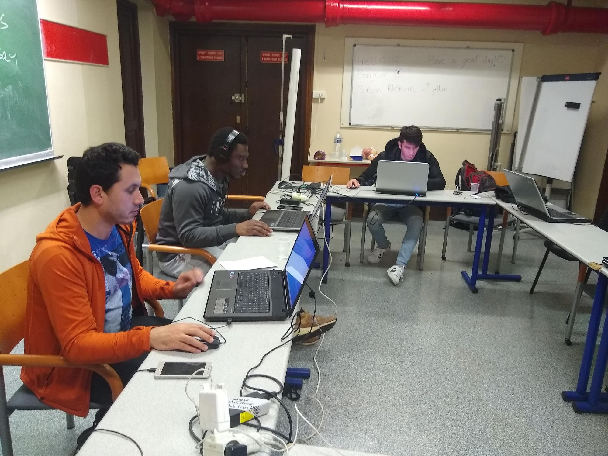

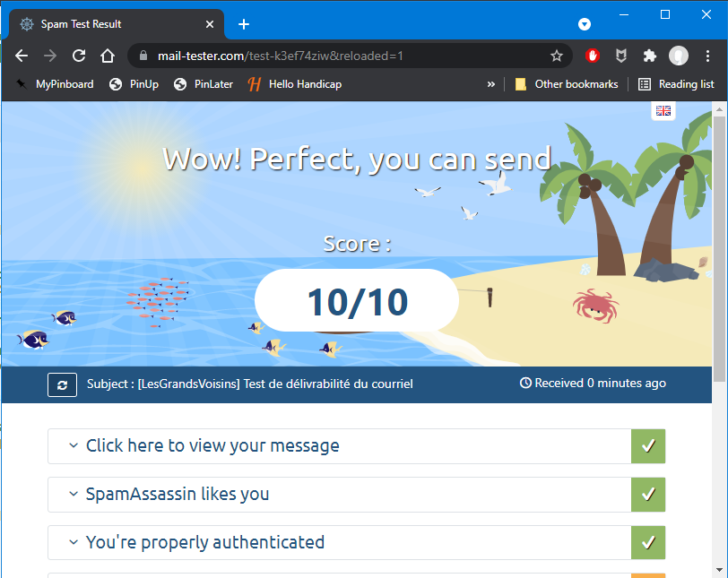

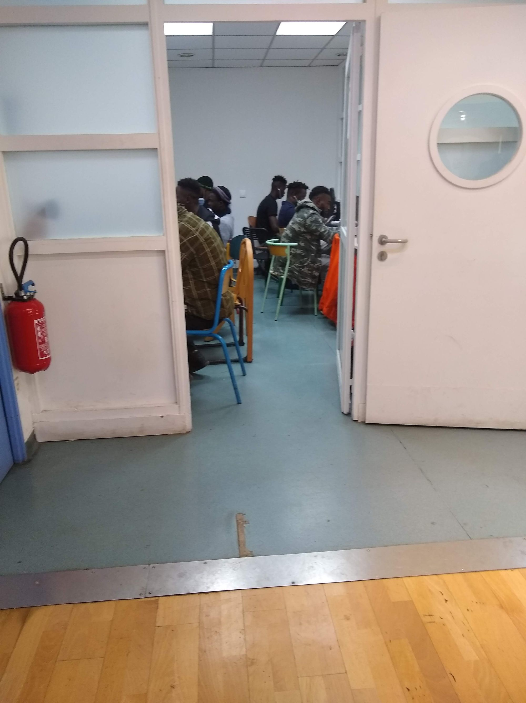

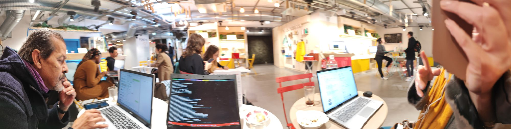

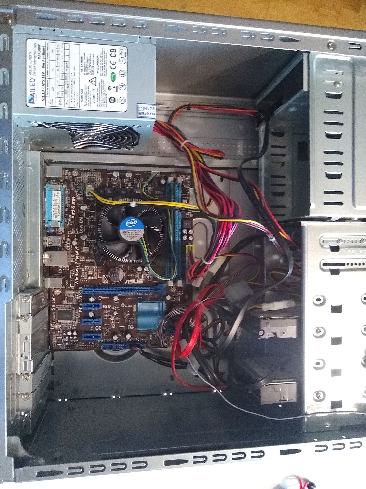

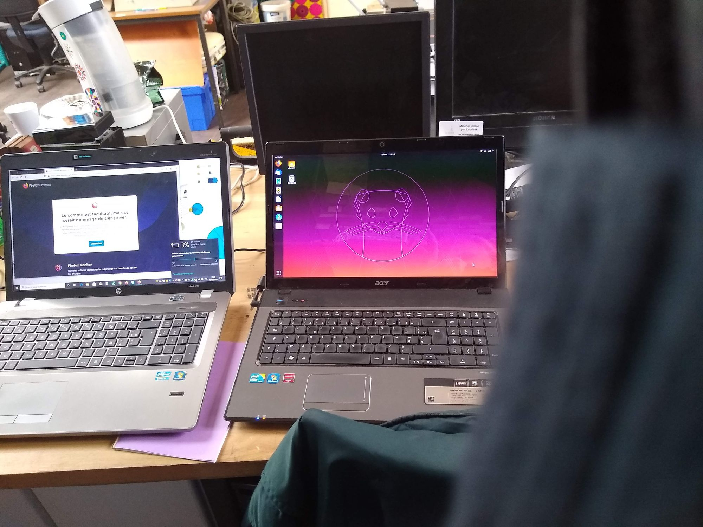

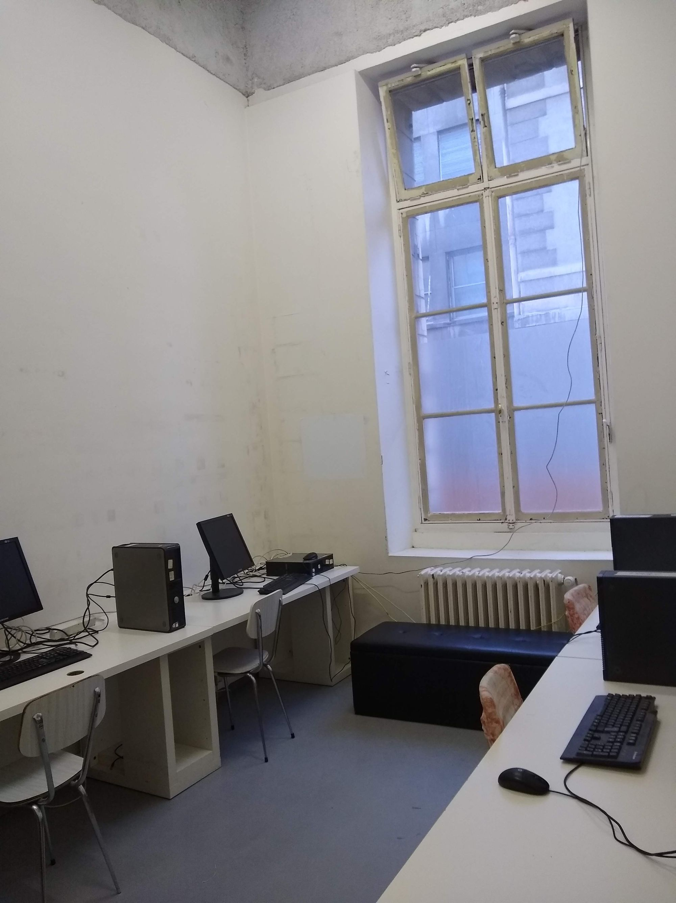

Cela fait plaisir d'accompagner dans le numérique créatif des Grands Voisins :)