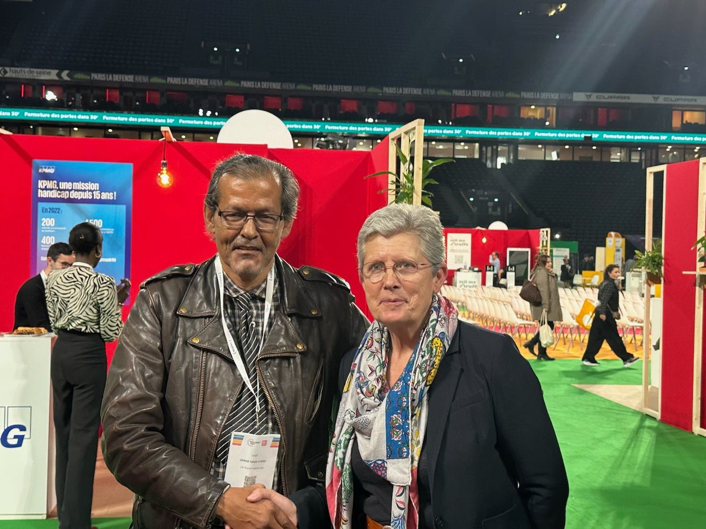
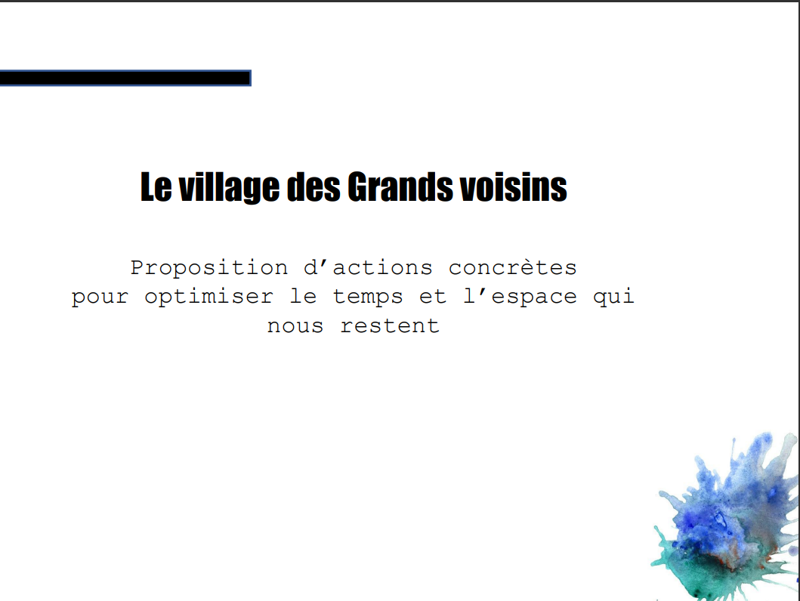
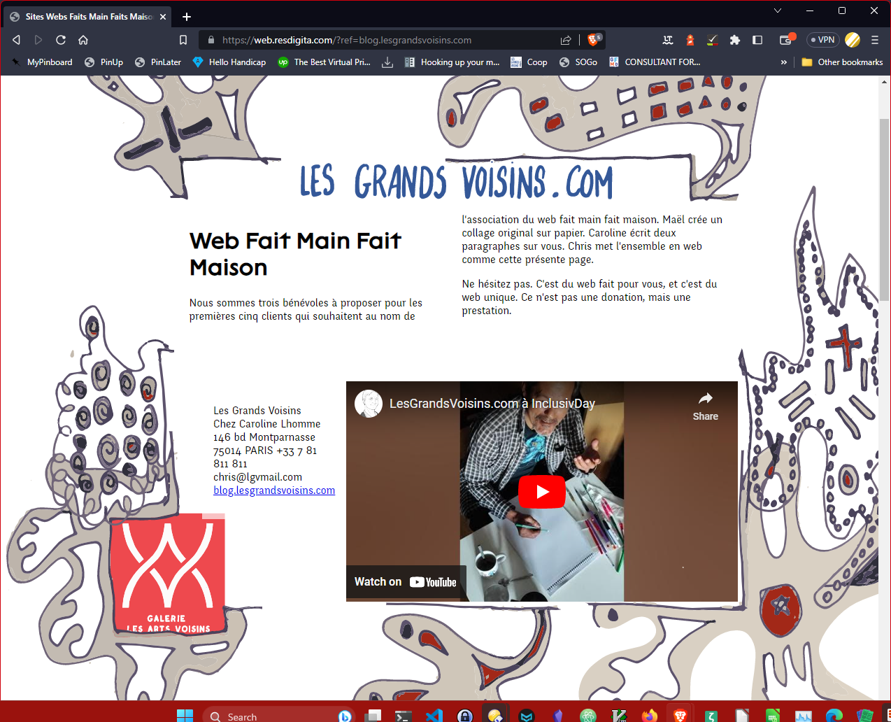
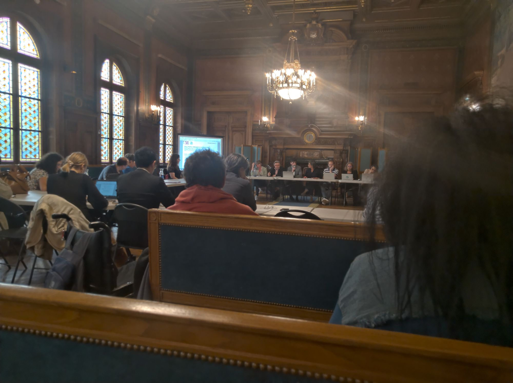
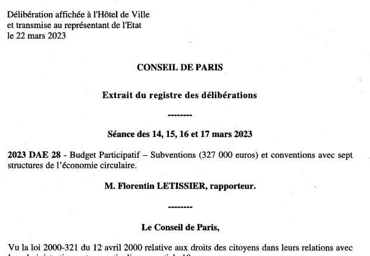

Madame la Maire du 14e arrondissement conseille de laisser tomber l'argumentaire dit « de responsabilité de la marque » Les Grands Voisins. J'avais utilisé l'argument le 25 mars 2023 sur l'ancien site Saint Vincent de Paul lorsque un cadre supérieur de l'association Aurore m'a publiquement snobé. Je n'étais pas en forme et l'article de blog à ce sujet était aussi écrit d'une posture défensive.

Je retiens de la suggestion une posture qui se base plus sur le présent et sur l'avenir !

Nous avons voté une prise de position forte au 17e Conseil des Voisins pour nous déclarer organisme d'intérêt général. La déclaration d'organisme d'intérêt général requiert trois conditions:

1. une gestion désintéressée,
2. pas d'activité lucrative,
3. pas de fonctionnement au profit d'un cercle restreint.

Pas plus tard que le 10 mai, déjà nous sommes testés sur les points 1 et 3 de par la visite de Madame la Ministre déléguée au Handicap, Geneviève Darrieussecq à Inclusiv'Day.

Maël Aïnine Néma Chérif pour Les Grands Voisins avec Madame la Ministre Déléguée au Handicap, Geneviève Darrieussecq 

Maël, Vice Président des Grands Voisins, et à Inclusiv'Day pour Les Grands Voisins a envoyé une lettre de sollicitation pour le compte de son association La Caravane CECAI un soutien, un financement, et un encouragement de financement de tiers.

Cette action m'incite à proposer urgemment un organe de contrôle de notre adhérence à nos déclarations (Contrat pour le Web, Coop, Intérêt Général). Maël pourrait être alors en erreur au regard de notre déclaration d'intérêt général.

La discussion à avoir pour Les Grands Voisins avec Mme. la Ministre Déléguée au Handicap tourne autour du [Manifeste des Grands Voisins](https://blog.lesgrandsvoisins.com/manifeste). C'est pour cela que nous aurions besoin d'un comité de contrôle de notre déclaration d'intérêt général. Pour comprendre l'erreur, imaginez que vous faite partie d'un organisme qui prétend être désintéressé, puis vous apprenez que les dirigeants obtiennent des avantages pour des organismes tiers dans leur gestion de l'organisme.

Comme toute Grande Voisine et tout Grand Voisin, Maël A.N.C. et la Caravane CECAI ont des projets louables, mais Les Grands Voisins ne peuvent pas soutenir directement ou indirectement aucune des initiatives. Soutenir une initiative porte automatiquement préjudice, à mon sens, à toutes les initiatives que nous ne soutenons pas. Malheureusement, cette tendance a une historique dans les Grands Voisins.

Une initiative « Village des Grands Voisins » en avril 2019 

En avril 2019, certains acteurs ont proposé un « Village des Grands Voisins » dont on comptait princiaplement Les Petits Débrouillard et Frédéric G.. Ce projet avait, à mon sens, probablement déjà cette notion de profiter à un cercle restreint de personnes. Il avait prévu explicitement un budget de 20.000 euros pour un financement de salaire à mi-temps pour Maël ANC. Les montants de cette initiative là étaient petits.

Notre défi est grand. L'intérêt général aurait besoin d'un comité de contrôle. Pour cela, la robustesse de la part de la contribution de Maël ANC a apporté ses fruits.

Mon autre vice-président me pose une question par rapport à un projet accessoire que nous avions avec Maël – le [web fait main fait maison](https://web.resdigita.com/) – qui était conçu pour financer notre présence à Inclusiv'Day. (A savoir que l'avance nous permettant à aller à Inclusv'Day venait de Maël.) L'observation de Caroline était que ce projet aurait pu enfreindre la condition 2 d'intérêt général. Chapeau Caroline !

Mon erreur probable de proposer en kermesse les activités bénévoles pour le bénéfice des Grands Voisins

L'idée que j'avais pour le web fait main était plus à l'image de kermesse d'école. C'était une activité plus symbolique. Pourtant, la question de Caroline ouvre la question exactement où elle doit aller ! (Et, effectivement, l'activité de bénévolat aurait besoin d'être scrutée.)

Il n'y auraient peut-être pas de problème à mon sens que les acteurs se revendiquent des Grands Voisins dans leurs activités. C'est un honneur pour Les Grands Voisins. Le problème vient quand Les Grands Voisins utilise sa position pour promouvoir un acteur. La question est d'actualité pour le sujet du budget participatif de Paris « [le numérique créatif des Grands Voisins](https://blog.lesgrandsvoisins.com/lancement-du-budget-participatif/) ».

Je dis que je suis lauréat, car il s'agit d'une activité de bénévolat qui m'est personnelle sur le site Saint Vincent de Paul, à une église depuis 2016 et au sein d'une resourcerie à Arcueil. C'est une chose que j'aime faire: équiper et animer des salles de sociabilité numérique. On y aborde d'abord la sociabilité et après le numérique afin de déstigmatiser le numérique. C'est vraiment splendide pour moi et pour beaucoup. Pourtant, effectivement, c'est mon kiffe, mon kiffe perso.

La Mairie du 14e en avril 2022 lors de la considération du numérique créatif des Grands Voisins

Entre le 13 et le 17 mars 2023 a eu lieu le Conseil de Paris. Un débat a eu lieu qui a, à mon sens, contrarié les conditions du budget participatif du 14e arrondissement. En parallèle depuis des années, il y aurait, je pense, une activité contre moi au sujet de la marque Les Grands Voisins. Le débat au Conseil de Paris semble avoir placé la Mairie du 14e et/ou la Mairie de Paris dans un effort probable de certains pour « tuer la marque » (je site un membre du bureau de l'association France Tiers Lieux qui donne une bonne caractérisation de la mouvance contre les Grands Voisins telle qu'ici). La délibération signée par Madame la Maire de Paris (Mme. HILDAGO) avait effectivement redirigé (je pense, d'après ce que je vois et les débats) le financement du numérique créatif des Grands Voisins à un projet différent. (Le projet différent aurait été l'agrandissement de l'atelier de la Resourcerie Créative, lorsque le projet « [le numérique créatif des Grands Voisins](https://blog.lesgrandsvoisins.com/lancement-du-budget-participatif/) » concernant entre autres [l'adaptation d'un atelier existant de la Ressourcerie Créative dans une approche](https://blog.lesgrandsvoisins.com/budget-participatif-avec-la-mairie-du-14e-et-la-ressourcerie-creative/) spécifique.)

Extrait du Conseil de Paris

Quand le budget participatif « [le numérique créatif des Grands Voisins](https://blog.lesgrandsvoisins.com/lancement-du-budget-participatif/) » était proposé, nous n'avions pas encore pris la partie d'intérêt général. Il convient aussi de regarder le budget participatif pour lequel plus de 4000 parisiens du 14e ont voté pour vérifier son intérêt général.

Il y a aussi la question du [16e Conseil des voisins](https://blog.lesgrandsvoisins.com/16e-conseil-des-voisins/) qui avait voté pour nommer « [ResDigita](https://www.resdigita.com) » les activités numériques des Grands Voisins. Comme je suis moi même débrouillard informatique, et pourrais (je ne le fais pas maintenant) y gagner ma vie, il convient aussi une vigilance à cela. Je pense qu'il convient de désinvestir Les Grands Voisins de la notion de ResDigita.

A mon sens l'avenir des Grands Voisins, association d'intérêt général coopérative, tient en une valeur ajoutée: la neutralité et la transparence avec personnalité, la personnalité de notre manifeste. Voilà ce que je propose pour le [18e Conseil des Voisins](https://blog.lesgrandsvoisins.com/18e-conseil/) !