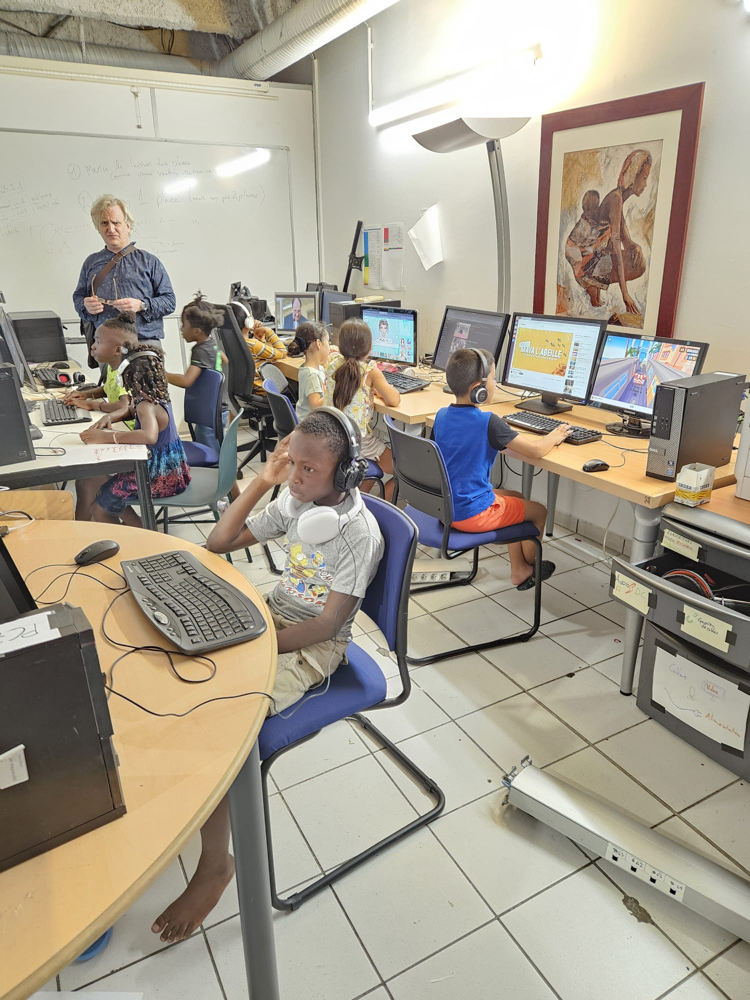
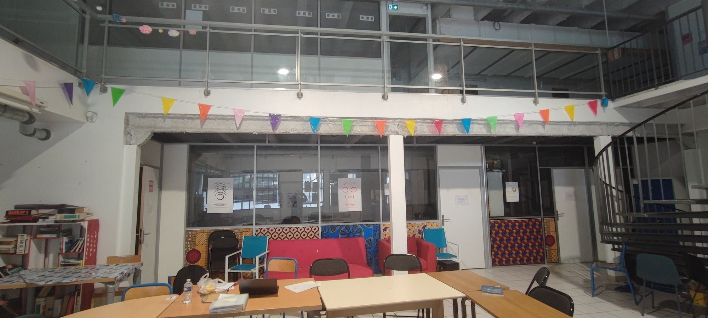
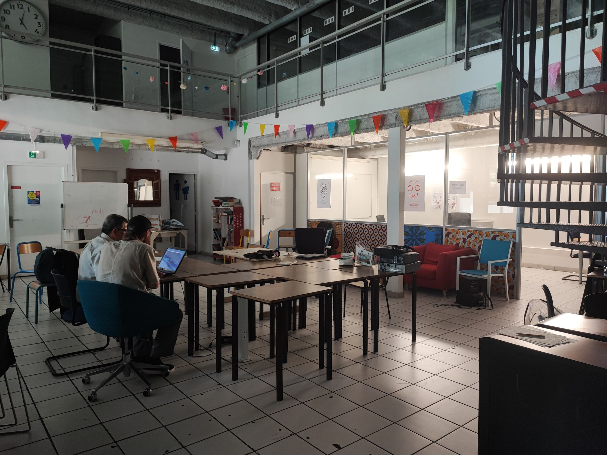
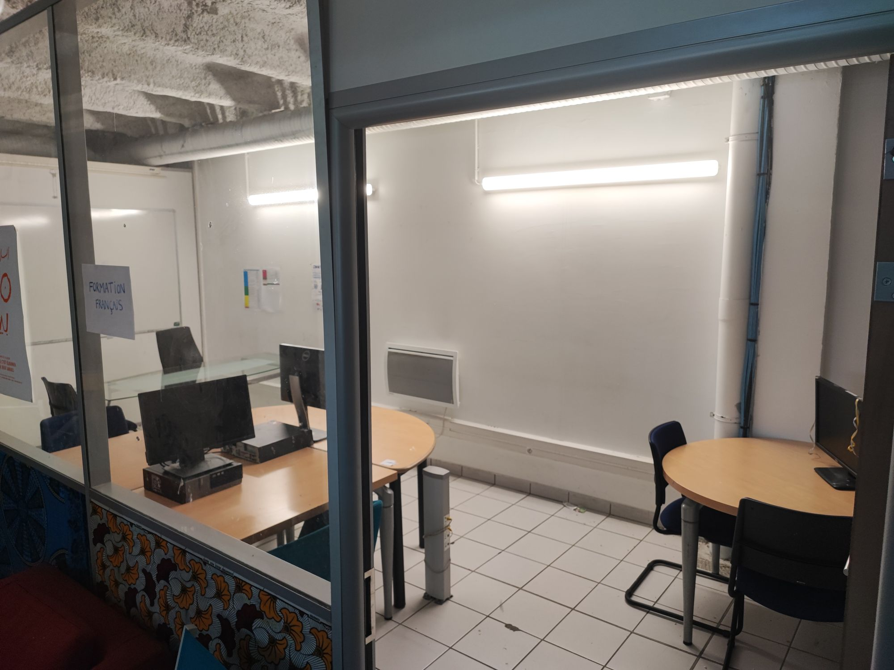
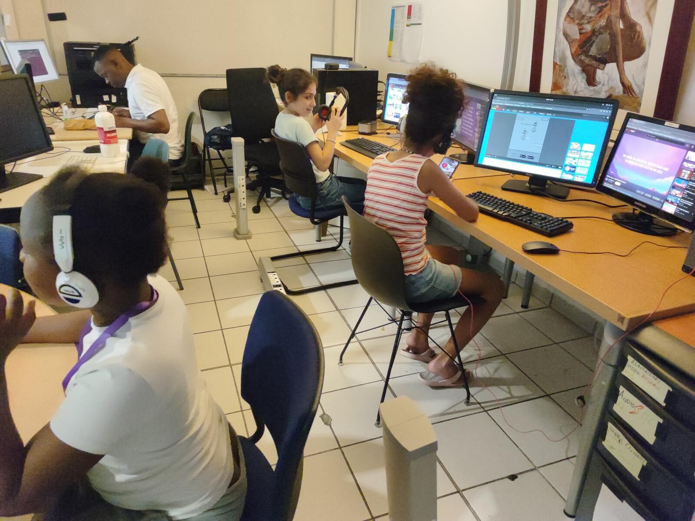
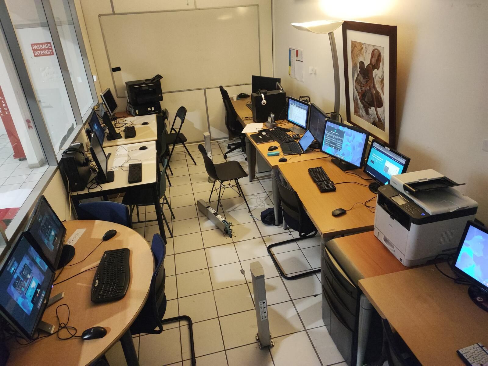
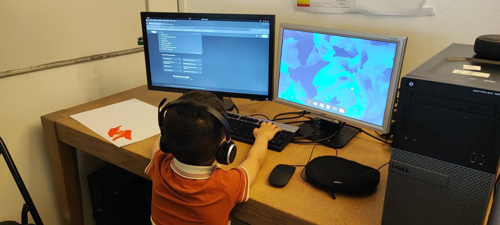
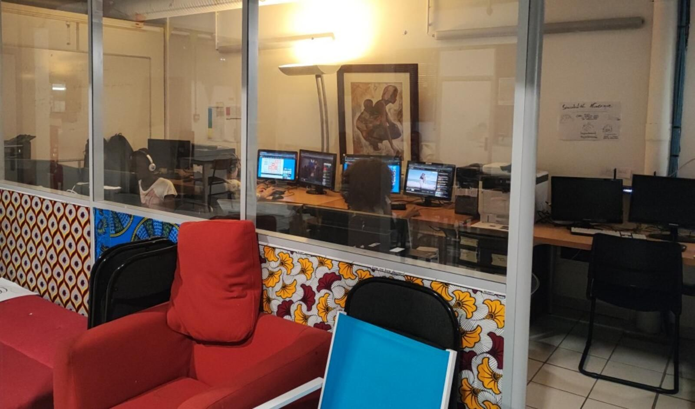
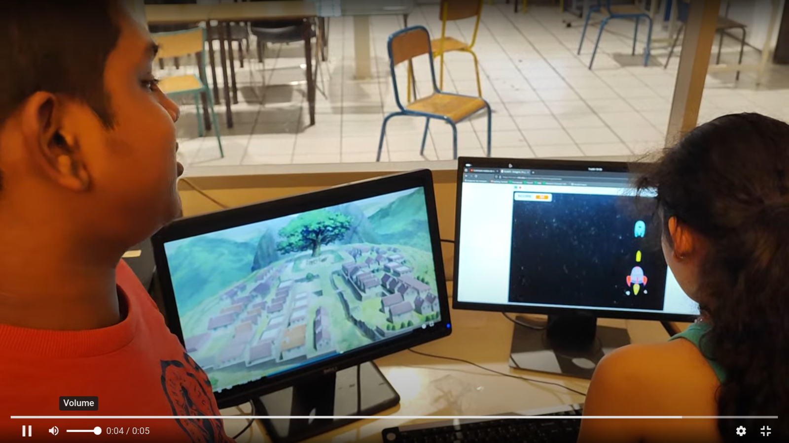
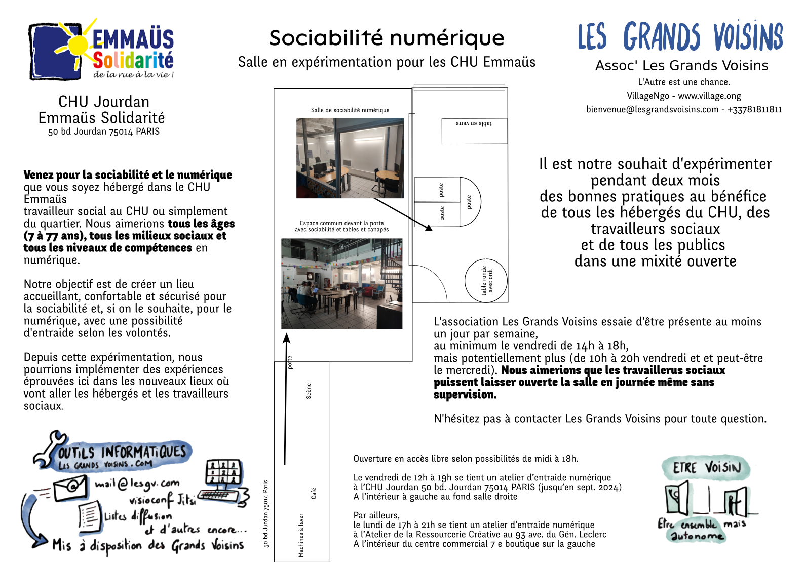

💡

Est impliqué la période du 15 juin au 15 septembre.  
L'objectif est une expérimentation pour trouver une approche peu intrusive pour armer les travailleurs sociaux avec un outillage numérique, dont une salle de sociabilité numérique.

Ainsi a été le mot de lancement le 14 juin 2024 du numérique créatif des Grands Voisins au service du CHU Emmaüs Jourdan. En voici quelques photos :

Gallérie photos de la sociabilité numérique Emmaüs Jourdan par Les Grands Voisins

L'installation a démarré d'abord par un entretien avec le Directeur Mustafa B et la Cheffe de Service Isabelle B avec Chris M Responsable numérique et Alex L, participant. Suite à cela, Chris et Alex se sont réunis formellement avec l'ensemble des travailleurs sociaux du CHU Emmaüs Jourdan. L'implication des travailleurs sociaux était clef pour la réussite du dispositif.

Un premier accord pour citer Emmaüs Solidarité CHU Jourdan dans ce projet et partenariat date de février 2023. Avaient été désigné comme interlocuteur Lhedi N, travailleur social identifié comme innovateur pour la place du numérique dans l'accompagnement de personnes hébergées.

La réunion de démarrage a eu lieu en début mars. Les premiers achats et livraisons de matériaux ont lieu en fin mars. Les candidats initiaux de salles ont été soit à l'extérieur du bureau des travailleurs sociaux au deuxième étage, soit dans un petit bureau au rez-de-chaussée. En début juin, nous étions toujours fixés sur un petit bureau au rez-de-chausée avec un espace de sociabilité à l'extérieur. Le 21 juin, nous n'avions toujours pas les clefs, et nous avions opté pour une salle plus grande dont nous pouvions avoir les clefs plus tôt. Voici l'affiche validée au sujet du lancement de la salle de sociabilité numérique.

Document de lancement de la sociabilité numérique au CHU Emmaüs du 16 juillet 2024

Nous avons reçu un don de sept unités centrales de l'association Les Jardins Numériques et un don de sept écrans, des unités centrales et des imprimantes de l'association La Ressourcerie Créative.